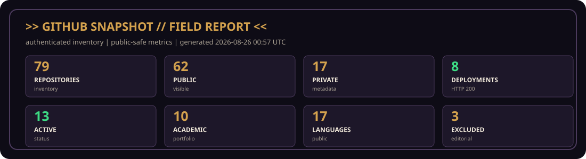
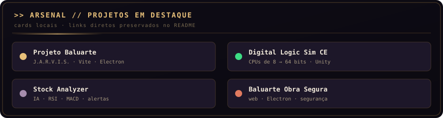
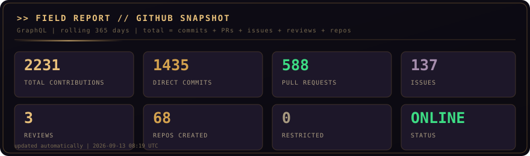
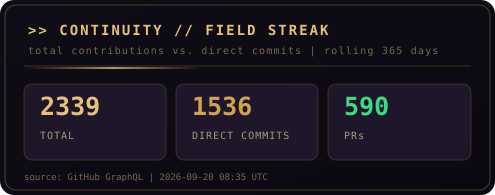
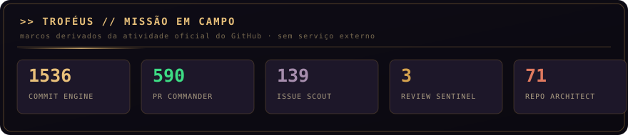

<div align="center">


[](https://github.com/Lucas-Belucci-Bellini)
[](https://unifil.br)
[](#)
[](https://github.com/Lucas-Belucci-Bellini/Lucas-Belucci-Bellini/tree/template/readme-style-kit)

</div>

---

```text
╔══════════════════════════════════════════════════════════════╗
║   BALUARTE // FIELD MANUAL — VOLUME I                        ║
║   ──────────────────────────────────────────────────────     ║
║   >> Agente    : Lucas Belucci Bellini                       ║
║   >> Codinome  : Spartan Gamer BR                            ║
║   >> Base      : Londrina, Paraná, Brasil                    ║
║   >> Missão    : Ciência da Computação / UNIFIL              ║
║   >> Arsenal   : Programação · Robótica · Eletrônica         ║
║   >> Status    : EM CAMPO — OPERACIONAL .........[OK]        ║
╚══════════════════════════════════════════════════════════════╝
```

## `// GITHUB SNAPSHOT` · RELATÓRIO DE CAMPO

> **Perfil em uma leitura:** construo sistemas do nível de portas lógicas a plataformas web, agentes de IA, ferramentas técnicas e jogos. O **Projeto Baluarte** é meu ecossistema-farol, com J.A.R.V.I.S., Git Nexus e uma trilha de projetos públicos documentados.

<!-- PROFILE-DASHBOARD:START -->
> `GITHUB SNAPSHOT // FIELD REPORT` · inventário autenticado, métricas públicas e governança editorial.



<div align="center">

| REPOSITÓRIOS | PÚBLICOS | PRIVADOS VISÍVEIS | DEPLOYMENTS |
|:---:|:---:|:---:|:---:|
| **79** | **62** | **17** | **9** |

| ATIVOS | ACADÊMICOS | LINGUAGENS | EXCLUSÕES EDITORIAIS |
|:---:|:---:|:---:|:---:|
| **13** | **10** | **17** | **3** |

</div>

> `STATUS: ONLINE` · `PRIVACY: SAFE` · contagens geradas pelo inventário autenticado do GitHub; nenhum conteúdo de arquivo privado é publicado.
<!-- PROFILE-DASHBOARD:END -->

## `// FICHA DE AGENTE` · PT-BR

Sou **Lucas Belucci Bellini**, também conhecido como **Spartan Gamer BR**. Estudo **Ciência da Computação na UNIFIL**, em Londrina/PR, e gosto de transformar ideias em sistemas que possam ser vistos, testados e melhorados.

Minha linha de construção vai de **CPUs de 8 a 64 bits feitas do zero** — porta lógica por porta lógica — até **aplicações web, agentes de IA, simulações, automações, projetos de hardware e jogos**. Gosto de explorar tecnologias novas, documentar o processo e terminar o que começo.

### `// AGENT FILE` · EN-US

I am **Lucas Belucci Bellini**, also known as **Spartan Gamer BR**. I study **Computer Science at UNIFIL** in Londrina, Brazil, and I turn ideas into systems that can be explored, tested and improved.

My work ranges from **8-to-64-bit CPUs built from scratch** to **web applications, AI agents, simulations, automation, hardware projects and games**. I enjoy exploring new technologies, documenting the process and finishing what I start.

## `// MISSÃO PRINCIPAL` · PROJETO BALUARTE

<div align="center">

[](https://github.com/Lucas-Belucci-Bellini/Projeto-Baluarte)
[](https://projeto-baluarte.vercel.app)
[](https://github.com/Lucas-Belucci-Bellini/Projeto-Baluarte)

</div>

O Baluarte reúne narrativa, engenharia, interface, automação, lógica digital e experiências interativas. O núcleo visual do J.A.R.V.I.S. pode ser explorado aqui:

<div align="center">



</div>

- [Abrir o J.A.R.V.I.S. Núcleo V7 — modelagem 3D funcional](https://projeto-baluarte.vercel.app/project%20V2/Modelar%20objeto%203D/jarvis-nucleo-v7.html)
- [Ver o código-fonte do núcleo visual](https://github.com/Lucas-Belucci-Bellini/Projeto-Baluarte/blob/main/project%20V2/Modelar%20objeto%203D/jarvis-nucleo-v7.html)

## `// ARSENAL` · TECH STACK & TOOLS

### ⚡ Linguagens / Languages

<div align="center">

[](https://skillicons.dev)

[](https://skillicons.dev)

</div>

<!-- LANGUAGE-BADGES:START -->
> **17 linguagens públicas detectadas** · badges gerados a partir dos repositórios auditados.
> Os nomes permanecem legíveis mesmo quando a URL precisa escapar caracteres como `#` e `/`; a matriz abaixo informa peso em bytes e participação relativa.

**PRINCIPAIS POR VOLUME**

[](https://github.com/Lucas-Belucci-Bellini?tab=repositories&q=&language=JavaScript) [](https://github.com/Lucas-Belucci-Bellini?tab=repositories&q=&language=TypeScript) [](https://github.com/Lucas-Belucci-Bellini?tab=repositories&q=&language=HTML) [](https://github.com/Lucas-Belucci-Bellini?tab=repositories&q=&language=CSS) [](https://github.com/Lucas-Belucci-Bellini?tab=repositories&q=&language=Java)
<br>
[](https://github.com/Lucas-Belucci-Bellini?tab=repositories&q=&language=Python) [](https://github.com/Lucas-Belucci-Bellini?tab=repositories&q=&language=C%23) [](https://github.com/Lucas-Belucci-Bellini?tab=repositories&q=&language=PLpgSQL) [](https://github.com/Lucas-Belucci-Bellini?tab=repositories&q=&language=Rust)


**EXTENSÕES DO PORTFÓLIO**

[](https://github.com/Lucas-Belucci-Bellini?tab=repositories&q=&language=SQF) [](https://github.com/Lucas-Belucci-Bellini?tab=repositories&q=&language=Shell) [](https://github.com/Lucas-Belucci-Bellini?tab=repositories&q=&language=GDScript) [](https://github.com/Lucas-Belucci-Bellini?tab=repositories&q=&language=PowerShell) [](https://github.com/Lucas-Belucci-Bellini?tab=repositories&q=&language=Portugol)
<br>
[](https://github.com/Lucas-Belucci-Bellini?tab=repositories&q=&language=Batchfile) [](https://github.com/Lucas-Belucci-Bellini?tab=repositories&q=&language=ShaderLab) [](https://github.com/Lucas-Belucci-Bellini?tab=repositories&q=&language=Dockerfile)
<!-- LANGUAGE-BADGES:END -->

### 🛠 Ferramentas / Tools

<div align="center">

[](https://skillicons.dev)

</div>

<!-- ARSENAL-STACK:START -->
> **17 linguagens detectadas** no inventário público. O peso e a quantidade de repositórios são calculados automaticamente pelo GitHub.

| Linguagem | Repositórios | Participação |
|:---|---:|---:|
| **JavaScript** | 17 | `36.36%` |
| **TypeScript** | 5 | `25.07%` |
| **HTML** | 18 | `20.75%` |
| **CSS** | 13 | `4.92%` |
| **Java** | 4 | `4.07%` |
| **Python** | 6 | `3.68%` |
| **C#** | 2 | `3.07%` |
| **PL/pgSQL** | 2 | `0.62%` |
| **Rust** | 3 | `0.44%` |
| **SQF** | 1 | `0.31%` |
| **Shell** | 5 | `0.24%` |
| **GDScript** | 1 | `0.21%` |
| **PowerShell** | 2 | `0.16%` |
| **Portugol** | 4 | `0.07%` |
| **Batch** | 5 | `0.03%` |
| **ShaderLab** | 1 | `0.01%` |
| **Dockerfile** | 1 | `0.00%` |

### Ferramentas, plataformas e ambientes

| Ferramenta | Papel | Evidência pública |
|:---|:---|:---|
| **Git** | versionamento | repositórios públicos e atividades de Git/GitHub |
| **GitHub** | colaboração e CI | repositório de perfil, Actions e inventário auditado |
| **VS Code** | editor | stack visual preservada e documentação de desenvolvimento |
| **Linux** | ambiente | stack visual preservada e scripts Shell/PowerShell |
| **Node.js** | runtime web | projetos públicos JavaScript/TypeScript e manifests Node |
| **Vite** | build e dev server | Projeto-Baluarte, Veritas, DailyPlanner e projetos web documentados |
| **React** | interface web | projetos públicos e dependências documentadas |
| **Tailwind CSS** | estilo web | stack visual preservada e projetos web documentados |
| **Electron** | desktop | Projeto-Baluarte e baluarte-obra-segura |
| **Docker** | infraestrutura | Dockerfile detectado no inventário público |
| **Supabase** | backend e dados | Veritas |
| **MCP** | integrações de agentes | Veritas e documentação pública relacionada |
| **Unity** | simulação e jogos | Digital Logic Sim CE |
| **Arduino** | eletrônica | arsenal visual original e linha de robótica/eletrônica |
| **Obsidian + Claude** | conhecimento e IA | AI-second-brain-with-Claude-and-Obsidian |
| **MapLibre GL** | mapas web | Project-Vanguard |
| **Flowgorithm + Portugol** | fundamentos | repositórios acadêmicos públicos |

> A lista de ferramentas é editorial e baseada em READMEs, manifests, configurações e seções visuais preservadas; ela não substitui o mapa automático de linguagens.
<!-- ARSENAL-STACK:END -->

> **Leitura do Arsenal:** os ícones aceleram o reconhecimento visual; os blocos gerados abaixo registram a evidência pública e a participação relativa das linguagens.

## `// MISSÕES EM DESTAQUE` · FEATURED MISSIONS

<!-- FEATURED-PROJECTS:START -->
| Projeto | O que a evidência pública confirma | Status | Acesso |
|:---|:---|:---|:---|
| **Projeto-Baluarte** | Plataforma narrativa, tática e técnica; o site público expõe o núcleo online, J.A.R.V.I.S., Git Nexus e módulos de conteúdo. | 🟡 In Development | [GitHub](https://github.com/Lucas-Belucci-Bellini/Projeto-Baluarte) · [Site](https://projeto-baluarte.vercel.app) |
| **Veritas** | Calculadora de tabelas verdade e ferramenta local-first para projetar circuitos lógicos, com editor visual, simulação e MCP documentados. | 🟢 Active | [GitHub](https://github.com/Lucas-Belucci-Bellini/Veritas) · [Site](https://veritas-opal-seven.vercel.app) |
| **baluarte-obra-segura** | Hub de engenharia para gestão de obras, editor de painéis elétricos, calculadoras e base WikiBuild, conforme a descrição pública. | 🟢 Active | [GitHub](https://github.com/Lucas-Belucci-Bellini/baluarte-obra-segura) · [Site](https://baluarte-obra-segura.vercel.app) |
| **Ark-Initiative** | Conceito ARCA de infraestrutura de resiliência climática e ambiental, com visão pública de dados, simulação e resposta. | 🟡 In Development | [GitHub](https://github.com/Lucas-Belucci-Bellini/Ark-Initiative) |
| **Project-Vanguard** | GPS topográfico tático e computador de tiro em JavaScript/Vite/MapLibre GL, conforme o README público. | 🟢 Active | [GitHub](https://github.com/Lucas-Belucci-Bellini/Project-Vanguard) · [Site](https://project-vanguard-cyan.vercel.app) |
| **CHIPS-Digital-Logic-Sim-Lucas-Belucci** | Coleção pública de chips e testes de lógica digital. | 🟡 In Development | [GitHub](https://github.com/Lucas-Belucci-Bellini/CHIPS-Digital-Logic-Sim-Lucas-Belucci) |
| **DailyPlanner** | Agenda diária em TypeScript/Vite para cadastrar, editar, concluir, excluir, buscar e filtrar atividades no navegador. | 🟢 Active | [GitHub](https://github.com/Lucas-Belucci-Bellini/DailyPlanner) |
| **Projeto-Baluarte-World-Game** | Conceito e protótipo de jogo de sobrevivência, construção e consequência situado no universo Baluarte. | 🟡 In Development | [GitHub](https://github.com/Lucas-Belucci-Bellini/Projeto-Baluarte-World-Game) · [Site](https://projeto-baluarte-world-game.vercel.app) |
| **Recycle-game** | Jogo educativo de reciclagem e automação com protótipo jogável documentado. | 🟡 In Development | [GitHub](https://github.com/Lucas-Belucci-Bellini/Recycle-game) |
| **Digital-Logic-Sim-CE** | Fork público da Community Edition de Digital Logic Sim, com recursos de simulação de lógica digital documentados no README. | 🔵 Experimental | [GitHub](https://github.com/Lucas-Belucci-Bellini/Digital-Logic-Sim-CE) |
<!-- FEATURED-PROJECTS:END -->

## `// MISSÕES ESCOLHIDAS` · CURATED MISSIONS

> Uma seleção editorial das frentes que melhor representam a construção do ecossistema: produto, lógica digital, engenharia, IA, web e jogos.

<!-- CURATED-FEATURED:START -->
> Uma seleção editorial das frentes que melhor representam a construção do ecossistema: produto, lógica digital, engenharia, IA, web e jogos.

| # | Missão | Foco confirmado | Status | Acesso |
|:--:|:---|:---|:---|:---|
| 1 | **FLAGSHIP / ECOSSISTEMA** · Projeto-Baluarte | Plataforma narrativa e técnica com J.A.R.V.I.S., Git Nexus e módulos web; o site público está em reconstrução da V2. | 🟡 In Development | [GitHub](https://github.com/Lucas-Belucci-Bellini/Projeto-Baluarte) · [Site](https://projeto-baluarte.vercel.app) |
| 2 | **DIGITAL LOGIC / LOCAL-FIRST** · Veritas | Calculadora de tabelas verdade e projetista de circuitos com editor visual, simulação e integrações documentadas. | 🟢 Active | [GitHub](https://github.com/Lucas-Belucci-Bellini/Veritas) · [Site](https://veritas-opal-seven.vercel.app) |
| 3 | **ENGINEERING / FIELD TOOL** · baluarte-obra-segura | Hub de engenharia para obras com editor de painéis, calculadoras, simuladores e base WikiBuild. | 🟢 Active | [GitHub](https://github.com/Lucas-Belucci-Bellini/baluarte-obra-segura) · [Site](https://baluarte-obra-segura.vercel.app) |
| 4 | **TACTICAL WEB / MAPS** · Project-Vanguard | GPS topográfico tático e computador de tiro construído com stack web e visualização geográfica. | 🟢 Active | [GitHub](https://github.com/Lucas-Belucci-Bellini/Project-Vanguard) · [Site](https://project-vanguard-cyan.vercel.app) |
| 5 | **CPU BUILD / SIMULATION** · Digital-Logic-Sim-CE | Simulação de lógica digital que documenta a linha de construção de computadores e chips funcionais. | 🔵 Experimental | [GitHub](https://github.com/Lucas-Belucci-Bellini/Digital-Logic-Sim-CE) |
| 6 | **WEB APP / PRODUCTIVITY** · DailyPlanner | Agenda web em TypeScript para organizar, buscar, filtrar e concluir atividades no navegador. | 🟢 Active | [GitHub](https://github.com/Lucas-Belucci-Bellini/DailyPlanner) |
| 7 | **GAME / WORLD-BUILDING** · Projeto-Baluarte-World-Game | Protótipo de sobrevivência, construção e consequência situado no universo Baluarte. | 🟡 In Development | [GitHub](https://github.com/Lucas-Belucci-Bellini/Projeto-Baluarte-World-Game) · [Site](https://projeto-baluarte-world-game.vercel.app) |
<!-- CURATED-FEATURED:END -->

## `// MAPA DO ECOSSISTEMA` · PROJECT MAP

> `MISSION BOARD // ARCHITECTURE` · o mapa completo fica recolhido para manter a primeira leitura rápida.

<!-- PROJECT-MAP:START -->
<details>
<summary><b>⌁ Complete project map</b></summary>

| Projeto | Categoria | Stack | Status | GitHub | Site |
|:---|:---|:---|:---|:---|:---|
| **-BANCO-DE-DADOS-** | Software & Ferramentas | `PowerShell` `Shell` | 🔒 Private | [GitHub](https://github.com/Lucas-Belucci-Bellini/-BANCO-DE-DADOS-) | — |
| **Academic-Portfolio** | Academia | `JavaScript` `HTML` | 🟣 Academic | [GitHub](https://github.com/Lucas-Belucci-Bellini/Academic-Portfolio) | — |
| **AEGIS** | Web | — | 🔒 Private | [GitHub](https://github.com/Lucas-Belucci-Bellini/AEGIS) | — |
| **AI-second-brain-with-Claude-and-Obsidian** | IA & Automação | `Shell` | 🟡 In Development | [GitHub](https://github.com/Lucas-Belucci-Bellini/AI-second-brain-with-Claude-and-Obsidian) | — |
| **Ark-Initiative** | Web | `TypeScript` `HTML` `JavaScript` `Rust` `CSS` | 🟡 In Development | [GitHub](https://github.com/Lucas-Belucci-Bellini/Ark-Initiative) | — |
| **Atividade-6** | Academia | — | 🟣 Academic | [GitHub](https://github.com/Lucas-Belucci-Bellini/Atividade-6) | — |
| **Atividade4** | Academia | `Portugol` | 🟣 Academic | [GitHub](https://github.com/itssomeone4/Atividade4) | — |
| **Backup-01-ALFA** | Infraestrutura / Backend / Dados | — | 🔒 Private | [GitHub](https://github.com/Lucas-Belucci-Bellini/Backup-01-ALFA) | — |
| **Baluarte** | Ecossistema Baluarte | `HTML` `JavaScript` `CSS` | 🔒 Private | [GitHub](https://github.com/Lucas-Belucci-Bellini/Baluarte) | — |
| **baluarte-academia** | Ecossistema Baluarte | — | 🟡 In Development | [GitHub](https://github.com/Lucas-Belucci-Bellini/baluarte-academia) | — |
| **baluarte-arsenal** | Ecossistema Baluarte | — | 🟡 In Development | [GitHub](https://github.com/Lucas-Belucci-Bellini/baluarte-arsenal) | — |
| **baluarte-audio** | Ecossistema Baluarte | — | 🟡 In Development | [GitHub](https://github.com/Lucas-Belucci-Bellini/baluarte-audio) | — |
| **baluarte-cibersec** | Ecossistema Baluarte | — | 🟡 In Development | [GitHub](https://github.com/Lucas-Belucci-Bellini/baluarte-cibersec) | — |
| **baluarte-content** | Ecossistema Baluarte | — | 🟡 In Development | [GitHub](https://github.com/Lucas-Belucci-Bellini/baluarte-content) | — |
| **baluarte-core** | Ecossistema Baluarte | — | 🟡 In Development | [GitHub](https://github.com/Lucas-Belucci-Bellini/baluarte-core) | — |
| **baluarte-data** | Ecossistema Baluarte | — | 🟡 In Development | [GitHub](https://github.com/Lucas-Belucci-Bellini/baluarte-data) | — |
| **baluarte-desktop** | Ecossistema Baluarte | — | 🟡 In Development | [GitHub](https://github.com/Lucas-Belucci-Bellini/baluarte-desktop) | — |
| **baluarte-docs** | Ecossistema Baluarte | `Python` | 🟡 In Development | [GitHub](https://github.com/Lucas-Belucci-Bellini/baluarte-docs) | — |
| **baluarte-economia** | Ecossistema Baluarte | — | 🟡 In Development | [GitHub](https://github.com/Lucas-Belucci-Bellini/baluarte-economia) | — |
| **baluarte-elites** | Ecossistema Baluarte | — | 🟡 In Development | [GitHub](https://github.com/Lucas-Belucci-Bellini/baluarte-elites) | — |
| **BALUARTE-FORGE-CONSTRUCTION** | Ecossistema Baluarte | `JavaScript` `CSS` `HTML` `Batch` | 🔒 Private | [GitHub](https://github.com/Lucas-Belucci-Bellini/BALUARTE-FORGE-CONSTRUCTION) | — |
| **baluarte-geo** | Ecossistema Baluarte | — | 🟡 In Development | [GitHub](https://github.com/Lucas-Belucci-Bellini/baluarte-geo) | — |
| **baluarte-infra** | Ecossistema Baluarte | — | 🟡 In Development | [GitHub](https://github.com/Lucas-Belucci-Bellini/baluarte-infra) | — |
| **baluarte-jarvis-core** | Ecossistema Baluarte | — | 🟡 In Development | [GitHub](https://github.com/Lucas-Belucci-Bellini/baluarte-jarvis-core) | — |
| **baluarte-jarvis-memory** | Ecossistema Baluarte | — | 🟡 In Development | [GitHub](https://github.com/Lucas-Belucci-Bellini/baluarte-jarvis-memory) | — |
| **baluarte-jarvis-tools** | Ecossistema Baluarte | — | 🟡 In Development | [GitHub](https://github.com/Lucas-Belucci-Bellini/baluarte-jarvis-tools) | — |
| **baluarte-midia** | Ecossistema Baluarte | — | 🟡 In Development | [GitHub](https://github.com/Lucas-Belucci-Bellini/baluarte-midia) | — |
| **baluarte-obra-segura** | Ecossistema Baluarte | `TypeScript` `JavaScript` `CSS` `HTML` | 🟢 Active | [GitHub](https://github.com/Lucas-Belucci-Bellini/baluarte-obra-segura) | [Site / Demo](https://baluarte-obra-segura.vercel.app) |
| **Baluarte-Portfolio** | Ecossistema Baluarte | — | 🔒 Private | [GitHub](https://github.com/Lucas-Belucci-Bellini/Baluarte-Portfolio) | — |
| **baluarte-profile** | Ecossistema Baluarte | — | 🟡 In Development | [GitHub](https://github.com/Lucas-Belucci-Bellini/baluarte-profile) | — |
| **baluarte-robotica** | Ecossistema Baluarte | — | 🟡 In Development | [GitHub](https://github.com/Lucas-Belucci-Bellini/baluarte-robotica) | — |
| **baluarte-shell** | Ecossistema Baluarte | — | 🟡 In Development | [GitHub](https://github.com/Lucas-Belucci-Bellini/baluarte-shell) | — |
| **baluarte-tools** | Ecossistema Baluarte | — | 🟡 In Development | [GitHub](https://github.com/Lucas-Belucci-Bellini/baluarte-tools) | — |
| **Baluarte_MarkIX_Node** | Ecossistema Baluarte | — | 🔒 Private | [GitHub](https://github.com/Lucas-Belucci-Bellini/Baluarte_MarkIX_Node) | — |
| **Catacombs-of-Paris-Ossuary-Escape-game-design** | Games | `HTML` `C#` `JavaScript` `GDScript` `Batch` | 🟡 In Development | [GitHub](https://github.com/Lucas-Belucci-Bellini/Catacombs-of-Paris-Ossuary-Escape-game-design) | — |
| **CHIPS-Digital-Logic-Sim-Lucas-Belucci** | Digital Logic / Hardware | — | 🟡 In Development | [GitHub](https://github.com/Lucas-Belucci-Bellini/CHIPS-Digital-Logic-Sim-Lucas-Belucci) | — |
| **CodeVibe-Academy** | Web | `JavaScript` `HTML` | 🟢 Active | [GitHub](https://github.com/Lucas-Belucci-Bellini/CodeVibe-Academy) | [Site / Demo](https://code-vibe-academy.vercel.app) |
| **Cookie-Clicker-Bot** | Software & Ferramentas | `JavaScript` | 🟢 Active | [GitHub](https://github.com/Lucas-Belucci-Bellini/Cookie-Clicker-Bot) | — |
| **Customizable-birthday-invitation** | Web | `HTML` | 🟡 In Development | [GitHub](https://github.com/Lucas-Belucci-Bellini/Customizable-birthday-invitation) | — |
| **DailyPlanner** | IA & Automação | `TypeScript` `CSS` `HTML` | 🟢 Active | [GitHub](https://github.com/Lucas-Belucci-Bellini/DailyPlanner) | — |
| **Decision-Structures** | Academia | `Portugol` | 🟣 Academic | [GitHub](https://github.com/Lucas-Belucci-Bellini/Decision-Structures) | — |
| **DelaOmegaAlfa** | Software & Ferramentas | — | 🔒 Private | [GitHub](https://github.com/Lucas-Belucci-Bellini/DelaOmegaAlfa) | — |
| **Digital-Logic-Sim-CE** | Digital Logic / Hardware | `C#` `CSS` `HTML` `JavaScript` `ShaderLab` | 🔵 Experimental | [GitHub](https://github.com/Lucas-Belucci-Bellini/Digital-Logic-Sim-CE) | — |
| **DriveTax-Motors** | Web | `Java` `HTML` `CSS` `Python` | 🟢 Active | [GitHub](https://github.com/Lucas-Belucci-Bellini/DriveTax-Motors) | — |
| **Essence-Custom-Furniture** | Web | `JavaScript` `HTML` | 🟢 Active | [GitHub](https://github.com/Lucas-Belucci-Bellini/Essence-Custom-Furniture) | [Site / Demo](https://essence-custom-furniture.vercel.app) |
| **fanfic-circulo-de-fogo** | Software & Ferramentas | `TypeScript` `JavaScript` `CSS` `HTML` | 🔒 Private | [GitHub](https://github.com/Lucas-Belucci-Bellini/fanfic-circulo-de-fogo) | — |
| **file-D-teste-1-site_nova_era-index.htmlfile-D-teste-1-site_nova_era-index.html** | Web | — | 🔒 Private | [GitHub](https://github.com/Lucas-Belucci-Bellini/file-D-teste-1-site_nova_era-index.htmlfile-D-teste-1-site_nova_era-index.html) | — |
| **Flowgorithm-** | Academia | — | 🟣 Academic | [GitHub](https://github.com/Lucas-Belucci-Bellini/Flowgorithm-) | — |
| **G-mod-Black-mesa** | Games | `Python` `Batch` | 🟡 In Development | [GitHub](https://github.com/Lucas-Belucci-Bellini/G-mod-Black-mesa) | — |
| **Games** | Games | — | 🔒 Private | [GitHub](https://github.com/Lucas-Belucci-Bellini/Games) | — |
| **Grupo-Atividade-4** | Academia | — | 🟣 Academic | [GitHub](https://github.com/Lucas-Belucci-Bellini/Grupo-Atividade-4) | — |
| **Guia-De-Fallout-4-Completo-** | Games | — | 🔒 Private | [GitHub](https://github.com/Lucas-Belucci-Bellini/Guia-De-Fallout-4-Completo-) | — |
| **Java-activities** | Academia | `Java` | 🟣 Academic | [GitHub](https://github.com/Lucas-Belucci-Bellini/Java-activities) | — |
| **JAVA-todos-os-codigos-em-java** | Academia | `Java` `Portugol` | 🟣 Academic | [GitHub](https://github.com/Lucas-Belucci-Bellini/JAVA-todos-os-codigos-em-java) | — |
| **Kizeo-Forms** | IA & Automação | — | 🟢 Active | [GitHub](https://github.com/Lucas-Belucci-Bellini/Kizeo-Forms) | — |
| **LLBR-Innovations-** | Ecossistema Baluarte | — | 🟡 In Development | [GitHub](https://github.com/Lucas-Belucci-Bellini/LLBR-Innovations-) | — |
| **LLBR-Innovations-Constructions** | Ecossistema Baluarte | `JavaScript` `HTML` `CSS` `Batch` | 🟡 In Development | [GitHub](https://github.com/Lucas-Belucci-Bellini/LLBR-Innovations-Constructions) | [Site / Demo](https://llbr-innovations-constructions.vercel.app) |
| **LOCAL-DE-TRABALHO** | Web | — | 🔒 Private | [GitHub](https://github.com/Lucas-Belucci-Bellini/LOCAL-DE-TRABALHO) | — |
| **Lucas-Belucci-Bellini** | Software & Ferramentas | `Python` | 🟢 Active | [GitHub](https://github.com/Lucas-Belucci-Bellini/Lucas-Belucci-Bellini) | — |
| **MOD-PACK-MINE-BACKUP** | Games | — | 🟢 Active | [GitHub](https://github.com/Lucas-Belucci-Bellini/MOD-PACK-MINE-BACKUP) | — |
| **Multi-functional-site-Baluarte** | Ecossistema Baluarte | — | 🟡 In Development | [GitHub](https://github.com/Lucas-Belucci-Bellini/Multi-functional-site-Baluarte) | — |
| **OMEGA-ALFA-DELTA** | Software & Ferramentas | `HTML` `CSS` `JavaScript` | 🟢 Active | [GitHub](https://github.com/Lucas-Belucci-Bellini/OMEGA-ALFA-DELTA) | — |
| **Portifolio-Baluarte-Lucas-Belucci-Bellini-** | Ecossistema Baluarte | `HTML` `CSS` `JavaScript` | 🟡 In Development | [GitHub](https://github.com/Lucas-Belucci-Bellini/Portifolio-Baluarte-Lucas-Belucci-Bellini-) | [Site / Demo](https://portifolio-baluarte-lucas-belucci-b.vercel.app) |
| **Project-Baluarte-DevFlow** | Ecossistema Baluarte | `PowerShell` `Shell` `Batch` | 🟡 In Development | [GitHub](https://github.com/Lucas-Belucci-Bellini/Project-Baluarte-DevFlow) | — |
| **Project-Vanguard** | Ecossistema Baluarte | `JavaScript` `CSS` `HTML` | 🟢 Active | [GitHub](https://github.com/Lucas-Belucci-Bellini/Project-Vanguard) | [Site / Demo](https://project-vanguard-cyan.vercel.app) |
| **Projeto-Baluarte** | Ecossistema Baluarte | `JavaScript` `HTML` `TypeScript` `CSS` `Python` | 🟡 In Development | [GitHub](https://github.com/Lucas-Belucci-Bellini/Projeto-Baluarte) | [Site / Demo](https://projeto-baluarte.vercel.app) |
| **Projeto-Baluarte-AI-Contador** | Ecossistema Baluarte | — | 🔒 Private | [GitHub](https://github.com/Lucas-Belucci-Bellini/Projeto-Baluarte-AI-Contador) | — |
| **Projeto-Baluarte-New-game** | Ecossistema Baluarte | `Python` | 🔒 Private | [GitHub](https://github.com/Lucas-Belucci-Bellini/Projeto-Baluarte-New-game) | — |
| **Projeto-Baluarte-Social-Media** | Ecossistema Baluarte | — | 🟡 In Development | [GitHub](https://github.com/Lucas-Belucci-Bellini/Projeto-Baluarte-Social-Media) | — |
| **Projeto-Baluarte-World-Game** | Ecossistema Baluarte | `JavaScript` `CSS` `HTML` | 🟡 In Development | [GitHub](https://github.com/Lucas-Belucci-Bellini/Projeto-Baluarte-World-Game) | [Site / Demo](https://projeto-baluarte-world-game.vercel.app) |
| **Python** | Academia | `Python` | 🟣 Academic | [GitHub](https://github.com/Lucas-Belucci-Bellini/Python) | — |
| **Recycle-game** | Games | `JavaScript` `HTML` `CSS` | 🟡 In Development | [GitHub](https://github.com/Lucas-Belucci-Bellini/Recycle-game) | — |
| **Some-Pseudocode-and-exercise-codes** | Academia | `Portugol` | 🟣 Academic | [GitHub](https://github.com/Lucas-Belucci-Bellini/Some-Pseudocode-and-exercise-codes) | — |
| **taxforge** | Web | `TypeScript` `HTML` `JavaScript` `Python` `CSS` | 🔒 Private | [GitHub](https://github.com/Lucas-Belucci-Bellini/taxforge) | — |
| **Teste-** | Software & Ferramentas | — | 🟡 In Development | [GitHub](https://github.com/Lucas-Belucci-Bellini/Teste-) | — |
| **Teste-aula-git** | Software & Ferramentas | — | 🟡 In Development | [GitHub](https://github.com/Lucas-Belucci-Bellini/Teste-aula-git) | — |
| **UMBRA-LIMA-ALFA** | Digital Logic / Hardware | `JavaScript` | 🟢 Active | [GitHub](https://github.com/Lucas-Belucci-Bellini/UMBRA-LIMA-ALFA) | — |
| **Veritas** | Digital Logic / Hardware | `TypeScript` `JavaScript` `PL/pgSQL` `Rust` `CSS` | 🟢 Active | [GitHub](https://github.com/Lucas-Belucci-Bellini/Veritas) | [Site / Demo](https://veritas-opal-seven.vercel.app) |
| **Zoas-** | Software & Ferramentas | — | 🔒 Private | [GitHub](https://github.com/Lucas-Belucci-Bellini/Zoas-) | — |

</details>
<!-- PROJECT-MAP:END -->

## `// REPOSITÓRIOS PÚBLICOS` · PUBLIC PROJECTS

<!-- PUBLIC-PROJECTS:START -->
<details>
<summary><b>🌐 Public repository catalog</b></summary>

| Projeto | Categoria | Status | GitHub |
|:---|:---|:---|:---|
| **Academic-Portfolio** | Academia | 🟣 Academic | [GitHub](https://github.com/Lucas-Belucci-Bellini/Academic-Portfolio) |
| **AI-second-brain-with-Claude-and-Obsidian** | IA & Automação | 🟡 In Development | [GitHub](https://github.com/Lucas-Belucci-Bellini/AI-second-brain-with-Claude-and-Obsidian) |
| **Ark-Initiative** | Web | 🟡 In Development | [GitHub](https://github.com/Lucas-Belucci-Bellini/Ark-Initiative) |
| **Atividade-6** | Academia | 🟣 Academic | [GitHub](https://github.com/Lucas-Belucci-Bellini/Atividade-6) |
| **Atividade4** | Academia | 🟣 Academic | [GitHub](https://github.com/itssomeone4/Atividade4) |
| **baluarte-academia** | Ecossistema Baluarte | 🟡 In Development | [GitHub](https://github.com/Lucas-Belucci-Bellini/baluarte-academia) |
| **baluarte-arsenal** | Ecossistema Baluarte | 🟡 In Development | [GitHub](https://github.com/Lucas-Belucci-Bellini/baluarte-arsenal) |
| **baluarte-audio** | Ecossistema Baluarte | 🟡 In Development | [GitHub](https://github.com/Lucas-Belucci-Bellini/baluarte-audio) |
| **baluarte-cibersec** | Ecossistema Baluarte | 🟡 In Development | [GitHub](https://github.com/Lucas-Belucci-Bellini/baluarte-cibersec) |
| **baluarte-content** | Ecossistema Baluarte | 🟡 In Development | [GitHub](https://github.com/Lucas-Belucci-Bellini/baluarte-content) |
| **baluarte-core** | Ecossistema Baluarte | 🟡 In Development | [GitHub](https://github.com/Lucas-Belucci-Bellini/baluarte-core) |
| **baluarte-data** | Ecossistema Baluarte | 🟡 In Development | [GitHub](https://github.com/Lucas-Belucci-Bellini/baluarte-data) |
| **baluarte-desktop** | Ecossistema Baluarte | 🟡 In Development | [GitHub](https://github.com/Lucas-Belucci-Bellini/baluarte-desktop) |
| **baluarte-docs** | Ecossistema Baluarte | 🟡 In Development | [GitHub](https://github.com/Lucas-Belucci-Bellini/baluarte-docs) |
| **baluarte-economia** | Ecossistema Baluarte | 🟡 In Development | [GitHub](https://github.com/Lucas-Belucci-Bellini/baluarte-economia) |
| **baluarte-elites** | Ecossistema Baluarte | 🟡 In Development | [GitHub](https://github.com/Lucas-Belucci-Bellini/baluarte-elites) |
| **baluarte-geo** | Ecossistema Baluarte | 🟡 In Development | [GitHub](https://github.com/Lucas-Belucci-Bellini/baluarte-geo) |
| **baluarte-infra** | Ecossistema Baluarte | 🟡 In Development | [GitHub](https://github.com/Lucas-Belucci-Bellini/baluarte-infra) |
| **baluarte-jarvis-core** | Ecossistema Baluarte | 🟡 In Development | [GitHub](https://github.com/Lucas-Belucci-Bellini/baluarte-jarvis-core) |
| **baluarte-jarvis-memory** | Ecossistema Baluarte | 🟡 In Development | [GitHub](https://github.com/Lucas-Belucci-Bellini/baluarte-jarvis-memory) |
| **baluarte-jarvis-tools** | Ecossistema Baluarte | 🟡 In Development | [GitHub](https://github.com/Lucas-Belucci-Bellini/baluarte-jarvis-tools) |
| **baluarte-midia** | Ecossistema Baluarte | 🟡 In Development | [GitHub](https://github.com/Lucas-Belucci-Bellini/baluarte-midia) |
| **baluarte-obra-segura** | Ecossistema Baluarte | 🟢 Active | [GitHub](https://github.com/Lucas-Belucci-Bellini/baluarte-obra-segura) |
| **baluarte-profile** | Ecossistema Baluarte | 🟡 In Development | [GitHub](https://github.com/Lucas-Belucci-Bellini/baluarte-profile) |
| **baluarte-robotica** | Ecossistema Baluarte | 🟡 In Development | [GitHub](https://github.com/Lucas-Belucci-Bellini/baluarte-robotica) |
| **baluarte-shell** | Ecossistema Baluarte | 🟡 In Development | [GitHub](https://github.com/Lucas-Belucci-Bellini/baluarte-shell) |
| **baluarte-tools** | Ecossistema Baluarte | 🟡 In Development | [GitHub](https://github.com/Lucas-Belucci-Bellini/baluarte-tools) |
| **Catacombs-of-Paris-Ossuary-Escape-game-design** | Games | 🟡 In Development | [GitHub](https://github.com/Lucas-Belucci-Bellini/Catacombs-of-Paris-Ossuary-Escape-game-design) |
| **CHIPS-Digital-Logic-Sim-Lucas-Belucci** | Digital Logic / Hardware | 🟡 In Development | [GitHub](https://github.com/Lucas-Belucci-Bellini/CHIPS-Digital-Logic-Sim-Lucas-Belucci) |
| **CodeVibe-Academy** | Web | 🟢 Active | [GitHub](https://github.com/Lucas-Belucci-Bellini/CodeVibe-Academy) |
| **Cookie-Clicker-Bot** | Software & Ferramentas | 🟢 Active | [GitHub](https://github.com/Lucas-Belucci-Bellini/Cookie-Clicker-Bot) |
| **Customizable-birthday-invitation** | Web | 🟡 In Development | [GitHub](https://github.com/Lucas-Belucci-Bellini/Customizable-birthday-invitation) |
| **DailyPlanner** | IA & Automação | 🟢 Active | [GitHub](https://github.com/Lucas-Belucci-Bellini/DailyPlanner) |
| **Decision-Structures** | Academia | 🟣 Academic | [GitHub](https://github.com/Lucas-Belucci-Bellini/Decision-Structures) |
| **Digital-Logic-Sim-CE** | Digital Logic / Hardware | 🔵 Experimental | [GitHub](https://github.com/Lucas-Belucci-Bellini/Digital-Logic-Sim-CE) |
| **DriveTax-Motors** | Web | 🟢 Active | [GitHub](https://github.com/Lucas-Belucci-Bellini/DriveTax-Motors) |
| **Essence-Custom-Furniture** | Web | 🟢 Active | [GitHub](https://github.com/Lucas-Belucci-Bellini/Essence-Custom-Furniture) |
| **Flowgorithm-** | Academia | 🟣 Academic | [GitHub](https://github.com/Lucas-Belucci-Bellini/Flowgorithm-) |
| **G-mod-Black-mesa** | Games | 🟡 In Development | [GitHub](https://github.com/Lucas-Belucci-Bellini/G-mod-Black-mesa) |
| **Grupo-Atividade-4** | Academia | 🟣 Academic | [GitHub](https://github.com/Lucas-Belucci-Bellini/Grupo-Atividade-4) |
| **Java-activities** | Academia | 🟣 Academic | [GitHub](https://github.com/Lucas-Belucci-Bellini/Java-activities) |
| **JAVA-todos-os-codigos-em-java** | Academia | 🟣 Academic | [GitHub](https://github.com/Lucas-Belucci-Bellini/JAVA-todos-os-codigos-em-java) |
| **Kizeo-Forms** | IA & Automação | 🟢 Active | [GitHub](https://github.com/Lucas-Belucci-Bellini/Kizeo-Forms) |
| **LLBR-Innovations-** | Ecossistema Baluarte | 🟡 In Development | [GitHub](https://github.com/Lucas-Belucci-Bellini/LLBR-Innovations-) |
| **LLBR-Innovations-Constructions** | Ecossistema Baluarte | 🟡 In Development | [GitHub](https://github.com/Lucas-Belucci-Bellini/LLBR-Innovations-Constructions) |
| **Lucas-Belucci-Bellini** | Software & Ferramentas | 🟢 Active | [GitHub](https://github.com/Lucas-Belucci-Bellini/Lucas-Belucci-Bellini) |
| **MOD-PACK-MINE-BACKUP** | Games | 🟢 Active | [GitHub](https://github.com/Lucas-Belucci-Bellini/MOD-PACK-MINE-BACKUP) |
| **Multi-functional-site-Baluarte** | Ecossistema Baluarte | 🟡 In Development | [GitHub](https://github.com/Lucas-Belucci-Bellini/Multi-functional-site-Baluarte) |
| **OMEGA-ALFA-DELTA** | Software & Ferramentas | 🟢 Active | [GitHub](https://github.com/Lucas-Belucci-Bellini/OMEGA-ALFA-DELTA) |
| **Portifolio-Baluarte-Lucas-Belucci-Bellini-** | Ecossistema Baluarte | 🟡 In Development | [GitHub](https://github.com/Lucas-Belucci-Bellini/Portifolio-Baluarte-Lucas-Belucci-Bellini-) |
| **Project-Baluarte-DevFlow** | Ecossistema Baluarte | 🟡 In Development | [GitHub](https://github.com/Lucas-Belucci-Bellini/Project-Baluarte-DevFlow) |
| **Project-Vanguard** | Ecossistema Baluarte | 🟢 Active | [GitHub](https://github.com/Lucas-Belucci-Bellini/Project-Vanguard) |
| **Projeto-Baluarte** | Ecossistema Baluarte | 🟡 In Development | [GitHub](https://github.com/Lucas-Belucci-Bellini/Projeto-Baluarte) |
| **Projeto-Baluarte-Social-Media** | Ecossistema Baluarte | 🟡 In Development | [GitHub](https://github.com/Lucas-Belucci-Bellini/Projeto-Baluarte-Social-Media) |
| **Projeto-Baluarte-World-Game** | Ecossistema Baluarte | 🟡 In Development | [GitHub](https://github.com/Lucas-Belucci-Bellini/Projeto-Baluarte-World-Game) |
| **Python** | Academia | 🟣 Academic | [GitHub](https://github.com/Lucas-Belucci-Bellini/Python) |
| **Recycle-game** | Games | 🟡 In Development | [GitHub](https://github.com/Lucas-Belucci-Bellini/Recycle-game) |
| **Some-Pseudocode-and-exercise-codes** | Academia | 🟣 Academic | [GitHub](https://github.com/Lucas-Belucci-Bellini/Some-Pseudocode-and-exercise-codes) |
| **Teste-** | Software & Ferramentas | 🟡 In Development | [GitHub](https://github.com/Lucas-Belucci-Bellini/Teste-) |
| **Teste-aula-git** | Software & Ferramentas | 🟡 In Development | [GitHub](https://github.com/Lucas-Belucci-Bellini/Teste-aula-git) |
| **UMBRA-LIMA-ALFA** | Digital Logic / Hardware | 🟢 Active | [GitHub](https://github.com/Lucas-Belucci-Bellini/UMBRA-LIMA-ALFA) |
| **Veritas** | Digital Logic / Hardware | 🟢 Active | [GitHub](https://github.com/Lucas-Belucci-Bellini/Veritas) |

</details>
<!-- PUBLIC-PROJECTS:END -->

## `// REPOSITÓRIOS PRIVADOS` · PRIVATE PROJECTS

> A seção privada publica somente o recorte editorial permitido. Nenhum código, arquivo, token, segredo, `.env` ou estrutura interna é exibido.

<!-- PRIVATE-PROJECTS:START -->
<details>
<summary><b>🔒 Private repository catalog</b></summary>

| Projeto | Categoria | Descrição pública | Status | GitHub |
|:---|:---|:---|:---|:---|
| **-BANCO-DE-DADOS-** | Software & Ferramentas | Descrição pública não informada | 🔒 Private | [GitHub](https://github.com/Lucas-Belucci-Bellini/-BANCO-DE-DADOS-) |
| **AEGIS** | Web | Descrição pública não informada | 🔒 Private | [GitHub](https://github.com/Lucas-Belucci-Bellini/AEGIS) |
| **Backup-01-ALFA** | Infraestrutura / Backend / Dados | Descrição pública não informada | 🔒 Private | [GitHub](https://github.com/Lucas-Belucci-Bellini/Backup-01-ALFA) |
| **Baluarte** | Ecossistema Baluarte | Bom oque eu posso dizer é um site multi funções e com muitas coisas que são complexas  | 🔒 Private | [GitHub](https://github.com/Lucas-Belucci-Bellini/Baluarte) |
| **BALUARTE-FORGE-CONSTRUCTION** | Ecossistema Baluarte | Descrição pública não informada | 🔒 Private | [GitHub](https://github.com/Lucas-Belucci-Bellini/BALUARTE-FORGE-CONSTRUCTION) |
| **Baluarte-Portfolio** | Ecossistema Baluarte | Descrição pública não informada | 🔒 Private | [GitHub](https://github.com/Lucas-Belucci-Bellini/Baluarte-Portfolio) |
| **Baluarte_MarkIX_Node** | Ecossistema Baluarte | Descrição pública não informada | 🔒 Private | [GitHub](https://github.com/Lucas-Belucci-Bellini/Baluarte_MarkIX_Node) |
| **DelaOmegaAlfa** | Software & Ferramentas | Descrição pública não informada | 🔒 Private | [GitHub](https://github.com/Lucas-Belucci-Bellini/DelaOmegaAlfa) |
| **fanfic-circulo-de-fogo** | Software & Ferramentas | Descrição pública não informada | 🔒 Private | [GitHub](https://github.com/Lucas-Belucci-Bellini/fanfic-circulo-de-fogo) |
| **file-D-teste-1-site_nova_era-index.htmlfile-D-teste-1-site_nova_era-index.html** | Web | Descrição pública não informada | 🔒 Private | [GitHub](https://github.com/Lucas-Belucci-Bellini/file-D-teste-1-site_nova_era-index.htmlfile-D-teste-1-site_nova_era-index.html) |
| **Games** | Games | Descrição pública não informada | 🔒 Private | [GitHub](https://github.com/Lucas-Belucci-Bellini/Games) |
| **Guia-De-Fallout-4-Completo-** | Games | Crie no tedio | 🔒 Private | [GitHub](https://github.com/Lucas-Belucci-Bellini/Guia-De-Fallout-4-Completo-) |
| **LOCAL-DE-TRABALHO** | Web | dados para trabalho e criação de sites | 🔒 Private | [GitHub](https://github.com/Lucas-Belucci-Bellini/LOCAL-DE-TRABALHO) |
| **Projeto-Baluarte-AI-Contador** | Ecossistema Baluarte | Descrição pública não informada | 🔒 Private | [GitHub](https://github.com/Lucas-Belucci-Bellini/Projeto-Baluarte-AI-Contador) |
| **Projeto-Baluarte-New-game** | Ecossistema Baluarte | Descrição pública não informada | 🔒 Private | [GitHub](https://github.com/Lucas-Belucci-Bellini/Projeto-Baluarte-New-game) |
| **taxforge** | Web | Um analisador de bolsa de valores com dashboard interativo, indicadores técnicos e bot de recomendação de compra/venda. · Built with Manus | 🔒 Private | [GitHub](https://github.com/Lucas-Belucci-Bellini/taxforge) |
| **Zoas-** | Software & Ferramentas | Descrição pública não informada | 🔒 Private | [GitHub](https://github.com/Lucas-Belucci-Bellini/Zoas-) |

</details>

> 🔒 Private repository · nenhuma linha desta seção expõe código, secrets, `.env`, tokens, credenciais ou estrutura interna.
<!-- PRIVATE-PROJECTS:END -->

## `// MATRIZ DE LINGUAGENS` · LANGUAGE MATRIX

> A matriz considera somente repositórios públicos auditados. Os três projetos excluídos editorialmente não participam de contagens, catálogos, sites ou métricas.

<!-- LANGUAGE-STATS:START -->
> **17 linguagens** · **62 repositórios públicos** · **16.59 MB de código detectado** · atualizado em `2026-08-26 00:57 UTC`

| # | Linguagem | Peso | Participação | Repositórios |
|:--:|:---|---:|---:|---:|
| 1 | **JavaScript** | `6.03 MB` | `36.36%` | 17 |
| 2 | **TypeScript** | `4.16 MB` | `25.07%` | 5 |
| 3 | **HTML** | `3.44 MB` | `20.75%` | 18 |
| 4 | **CSS** | `836.2 KB` | `4.92%` | 13 |
| 5 | **Java** | `692.1 KB` | `4.07%` | 4 |
| 6 | **Python** | `625.0 KB` | `3.68%` | 6 |
| 7 | **C#** | `520.8 KB` | `3.07%` | 2 |
| 8 | **PL/pgSQL** | `104.6 KB` | `0.62%` | 2 |
| 9 | **Rust** | `75.1 KB` | `0.44%` | 3 |
| 10 | **SQF** | `52.0 KB` | `0.31%` | 1 |
| 11 | **Shell** | `40.8 KB` | `0.24%` | 5 |
| 12 | **GDScript** | `36.3 KB` | `0.21%` | 1 |
| 13 | **PowerShell** | `26.9 KB` | `0.16%` | 2 |
| 14 | **Portugol** | `11.7 KB` | `0.07%` | 4 |
| 15 | **Batch** | `5.3 KB` | `0.03%` | 5 |
| 16 | **ShaderLab** | `1.6 KB` | `0.01%` | 1 |
| 17 | **Dockerfile** | `460 B` | `0.00%` | 1 |

> A tabela acima considera somente repositórios públicos. Repositórios privados podem contribuir para métricas agregadas futuras, mas seus arquivos, nomes de arquivos e estrutura interna não são publicados.


<!-- LANGUAGE-STATS:END -->
## `// SITES VERIFICADOS` · LIVE DEPLOYMENTS

<!-- LIVE-PROJECTS:START -->
| Projeto | GitHub | Website | Status |
|:---|:---|:---|:---|
| **baluarte-obra-segura** | [GitHub](https://github.com/Lucas-Belucci-Bellini/baluarte-obra-segura) | [Site / Demo](https://baluarte-obra-segura.vercel.app) | HTTP 200 |
| **CodeVibe-Academy** | [GitHub](https://github.com/Lucas-Belucci-Bellini/CodeVibe-Academy) | [Site / Demo](https://code-vibe-academy.vercel.app) | HTTP 200 |
| **Essence-Custom-Furniture** | [GitHub](https://github.com/Lucas-Belucci-Bellini/Essence-Custom-Furniture) | [Site / Demo](https://essence-custom-furniture.vercel.app) | HTTP 200 |
| **LLBR-Innovations-Constructions** | [GitHub](https://github.com/Lucas-Belucci-Bellini/LLBR-Innovations-Constructions) | [Site / Demo](https://llbr-innovations-constructions.vercel.app) | HTTP 200 |
| **Portifolio-Baluarte-Lucas-Belucci-Bellini-** | [GitHub](https://github.com/Lucas-Belucci-Bellini/Portifolio-Baluarte-Lucas-Belucci-Bellini-) | [Site / Demo](https://portifolio-baluarte-lucas-belucci-b.vercel.app) | HTTP 200 |
| **Project-Vanguard** | [GitHub](https://github.com/Lucas-Belucci-Bellini/Project-Vanguard) | [Site / Demo](https://project-vanguard-cyan.vercel.app) | HTTP 200 |
| **Projeto-Baluarte** | [GitHub](https://github.com/Lucas-Belucci-Bellini/Projeto-Baluarte) | [Site / Demo](https://projeto-baluarte.vercel.app) | HTTP 200 |
| **Projeto-Baluarte-World-Game** | [GitHub](https://github.com/Lucas-Belucci-Bellini/Projeto-Baluarte-World-Game) | [Site / Demo](https://projeto-baluarte-world-game.vercel.app) | HTTP 200 |
| **Veritas** | [GitHub](https://github.com/Lucas-Belucci-Bellini/Veritas) | [Site / Demo](https://veritas-opal-seven.vercel.app) | HTTP 200 |
<!-- LIVE-PROJECTS:END -->

> **Critério:** um deployment só aparece como live quando a homepage declarada respondeu HTTP 200 durante a auditoria. URLs que falham não são apresentadas como online.

## `// NÚCLEO J.A.R.V.I.S.` · VISUAL CORE

<div align="center">

[](https://projeto-baluarte.vercel.app)

</div>

> **J.A.R.V.I.S.** é o assistente do Projeto Baluarte: modos local e web, memória, sessões persistentes e ferramentas integradas ao site por meio do Git Nexus. A imagem acima é uma amostra visual do núcleo na estética **Ouro de Fábula**.

## `// DIGITAL LOGIC SIM` · CPU BUILD LOG

```text
╔══════════════════════════════════════════════════════════════╗
║   DIGITAL LOGIC SIM — CPU BUILD LOG                          ║
║   Computadores funcionais do zero, porta lógica por porta     ║
╠══════════════════════════════════════════════════════════════╣
║   [######################]   8-BIT CPU ....[CONCLUÍDO]       ║
║   [######################]  16-BIT CPU ....[CONCLUÍDO]       ║
║   [######################]  32-BIT CPU ....[CONCLUÍDO]       ║
║   [######################]  64-BIT CPU ....[CONCLUÍDO]       ║
╚══════════════════════════════════════════════════════════════╝
```

Construí computadores funcionais de **8 a 64 bits** no Digital Logic Sim — da ULA à arquitetura completa, uma porta lógica por vez.

## `// CONTINUIDADE` · FIELD STREAK

<div align="center">






</div>

## `// ATIVIDADE` · ACTIVITY GRAPH

<div align="center">


</div>

## `// TROFÉUS` · FIELD MISSION

<div align="center">



</div>

## `// ARQUIVO PESSOAL` · PERSONAL LOG

### 🎮 Gaming

<div align="center">

[](https://www.halowaypoint.com)
[](https://warthunder.com)
[](https://store.steampowered.com)
[](https://store.steampowered.com)
[](https://store.steampowered.com)
[](https://store.steampowered.com)
[](https://store.steampowered.com)

</div>

### 📚 Minha Fan Fiction

> “Spartan never gives up. Spartan always finishes it.”

Uma seção dedicada às histórias e aos universos que crio — um espaço para imaginação e criatividade fluírem.

📖 [Minha Fan Fiction — início](https://docs.google.com/document/d/1FJulPVU1WA8LTLL3NO7h2CTW7pmlNWgO-C77qwtcVgU/edit?usp=drivesdk)

## `// CANAL DE COMUNICAÇÃO` · CONTACT

<div align="center">

[](https://github.com/Lucas-Belucci-Bellini)
[](https://www.linkedin.com/in/lucas-belucci-bellini-28044b328)
[](https://www.youtube.com/@Spartan_Gamer_BR)
[](https://www.tiktok.com/@lucasbeluccioficial?lang=pt-BR)
[](https://www.twitch.tv/spartan_gamer_pro)

[](https://steamcommunity.com/id/spartangamerbr)
[](https://open.spotify.com/user/spartanbr)
[](https://www.instagram.com/lucasbeluccioficial)
[](mailto:lucasbb2007@gmail.com)

</div>

---

```text
╔══════════════════════════════════════════════════════════════╗
║   “A melhor forma de prever o futuro é construí-lo.”         ║
║   “The best way to predict the future is to build it.”       ║
║                                                — Alan Kay    ║
╠══════════════════════════════════════════════════════════════╣
║   Spartan never gives up. Spartan always finishes it.        ║
╚══════════════════════════════════════════════════════════════╝
```

<div align="center">

[](https://github.com/Lucas-Belucci-Bellini)

</div>


