<div align="center">

[](https://github.com/Lucas-Belucci-Bellini)
[](https://unifil.br)
[](#)

</div>

---

```
╔══════════════════════════════════════════════════════════════╗
║   BALUARTE // FIELD MANUAL — VOLUME I                        ║
║   ──────────────────────────────────────────────────────     ║
║   >> Agente    : Lucas Belucci Bellini                       ║
║   >> Codinome  : Spartan Gamer BR                            ║
║   >> Base      : Londrina, Paraná, Brasil                    ║
║   >> Missão    : Ciência da Computação / UNIFIL              ║
║   >> Arsenal   : Programação · Robótica · Eletrônica         ║
║   >> Status    : EM CAMPO — OPERACIONAL .........[OK]        ║
╚══════════════════════════════════════════════════════════════╝
```

## `// FICHA DE AGENTE` — PT-BR

Oi! Sou o **Lucas Belucci Bellini**, também conhecido como **Spartan Gamer BR** — estudante de **Ciência da Computação** na **UNIFIL**, em Londrina/PR.

Construo desde **CPUs de 8 a 64 bits do zero** (porta lógica por porta lógica) até **plataformas web, agentes de IA e jogos**. Meu projeto-farol é o **⬡ Projeto Baluarte**, com o assistente **J.A.R.V.I.S.** e o motor **Git Nexus**. Gosto de tentar coisas novas e **sempre termino o que começo**, não importa quanto tempo demore. Apaixonado por carros, programação, robótica, eletrônica, filmes e jogos.

## `// AGENT FILE` — EN-US

Hi! I'm **Lucas Belucci Bellini**, a.k.a. **Spartan Gamer BR** — a Computer Science student at **UNIFIL**, Londrina, Brazil.

I build everything from **8-to-64-bit CPUs from scratch** (logic gate by logic gate) to **web platforms, AI agents and games**. My flagship is the **⬡ Projeto Baluarte**, home of the **J.A.R.V.I.S.** assistant and the **Git Nexus** engine. I love trying new things and **always finish what I start**, no matter how long it takes.

---


### ⚡ Linguagens / Languages

<div align="center">

[](https://skillicons.dev)

</div>

### 🛠 Ferramentas / Tools

<div align="center">

[](https://skillicons.dev)

</div>

---


<div align="center">

[](https://github.com/Lucas-Belucci-Bellini/Projeto-Baluarte)
[](https://github.com/Lucas-Belucci-Bellini/Digital-Logic-Sim-CE)

[](https://github.com/Lucas-Belucci-Bellini/stock-analyzer-bot)
[](https://github.com/Lucas-Belucci-Bellini/baluarte-obra-segura)

</div>

### 🗂 Arsenal completo / Full arsenal

| Projeto / Project | O que é / What it is | Stack |
| :--- | :--- | :--- |
| **[⬡ Projeto Baluarte](https://github.com/Lucas-Belucci-Bellini/Projeto-Baluarte)** | Plataforma web narrativa + militar + 40 ferramentas, com **J.A.R.V.I.S.** e **Git Nexus**. *Narrative/tools web platform.* | `JS` `Vite` `Electron` |
| **[🖥 Digital Logic Sim CE](https://github.com/Lucas-Belucci-Bellini/Digital-Logic-Sim-CE)** | Onde construí CPUs funcionais de 8→64 bits do zero. *Where I built working 8→64-bit CPUs.* | `C#` `Unity` |
| **[🧩 CHIPS Library](https://github.com/Lucas-Belucci-Bellini/CHIPS-Digital-Logic-Sim-Lucas-Belucci)** | Meus chips lógicos (AND/OR/NOT/NOR/XOR) e testes. *My saved logic chips.* | `JSON` |
| **[📈 Stock Analyzer](https://github.com/Lucas-Belucci-Bellini/stock-analyzer-bot)** | Plataforma de análise de ações com IA: RSI, MACD, Bollinger, alertas. *AI investment platform.* | `TypeScript` `Drizzle` |
| **[🦺 Baluarte Obra Segura](https://github.com/Lucas-Belucci-Bellini/baluarte-obra-segura)** | App (web + Electron) de segurança e gestão de obras. *Construction-safety & site management app.* | `TypeScript` `Electron` |
| **[🧠 AI Second Brain](https://github.com/Lucas-Belucci-Bellini/AI-second-brain-with-Claude-and-Obsidian)** | Setup de "segundo cérebro" Obsidian + Claude Code. *Obsidian + Claude second-brain kit.* | `Bash` |
| **[🍪 Cookie Clicker Bot](https://github.com/Lucas-Belucci-Bellini/Cookie-Clicker-Bot)** | Automador idle completo pro console do navegador. *Full idle automation bot.* | `JavaScript` |
| **[♻️ Jogo da Reciclagem](https://github.com/Lucas-Belucci-Bellini/Recycle-game)** | Jogo educativo de reciclagem + automação. *Educational recycling game.* | `HTML` `JS` |
| **[🏗 LLBR Innovations](https://github.com/Lucas-Belucci-Bellini/LLBR-Innovations-Constructions)** | Site institucional de construção (antes/depois, galeria). *Construction company site.* | `HTML` `CSS` |
| **[🧾 AI Contador (IRPF)](https://github.com/Lucas-Belucci-Bellini/Projeto-Baluarte-AI-Contador)** | Agente de IA para Imposto de Renda no Brasil. *AI accountant for Brazilian income tax.* | `Docs` `AI` |

---


> 🤖 Seção mantida por um **bot**: uma GitHub Action varre meus repositórios **públicos**
> de hora em hora, soma os bytes por linguagem e reescreve o que está abaixo — total de
> linguagens, o peso de cada uma e **em quais repositórios** ela foi usada.
> Repositórios privados ficam de fora, por design.
>
> *Kept by a bot: an hourly GitHub Action scans my public repos, aggregates bytes per
> language and rewrites the block below — totals, weight and where each one was used.
> Private repositories are excluded by design.*

<!-- LANG-STATS:START -->

> **16 linguagens** e **50 tipos de arquivo** em **58 repositórios** · **9.86 MB** de código · **16.649** arquivos · atualizado em `14/08/2026 13:13 UTC`

<div align="center">



</div>

### Linguagens

| # | Linguagem | Peso | % | Repositórios |
| :-- | :--- | ---: | ---: | ---: |
| 1 | **JavaScript** | `6.12 MB` | `62.11%` | 16 |
| 2 | **TypeScript** | `1021.8 KB` | `10.12%` | 3 |
| 3 | **CSS** | `751.5 KB` | `7.44%` | 11 |
| 4 | **Java** | `707.7 KB` | `7.01%` | 5 |
| 5 | **Python** | `554.8 KB` | `5.50%` | 5 |
| 6 | **HTML** | `499.9 KB` | `4.95%` | 16 |
| 7 | **SQF** | `52.0 KB` | `0.51%` | 1 |
| 8 | **C#** | `41.1 KB` | `0.41%` | 1 |
| 9 | **Shell** | `40.6 KB` | `0.40%` | 4 |
| 10 | **Rust** | `39.4 KB` | `0.39%` | 1 |
| 11 | **GDScript** | `36.3 KB` | `0.36%` | 1 |
| 12 | **PLpgSQL** | `36.0 KB` | `0.36%` | 1 |
| 13 | **PowerShell** | `26.9 KB` | `0.27%` | 2 |
| 14 | **Portugol** | `11.1 KB` | `0.11%` | 3 |
| 15 | **Batchfile** | `5.3 KB` | `0.05%` | 5 |
| 16 | **Dockerfile** | `960 B` | `0.01%` | 2 |

> 31 repositório(s) sem linguagem detectada pelo GitHub — contam no total, mas não na tabela.

### Tipos de arquivo

| # | Tipo | Arquivos | % | Família | Repositórios |
| :-- | :--- | ---: | ---: | :--- | ---: |
| 1 | `.webp` | `9588` | `57.59%` | imagem | 1 |
| 2 | `.json` | `2514` | `15.10%` | dado | 32 |
| 3 | `.p3d` | `1302` | `7.82%` | modelo 3D | 1 |
| 4 | `.java` | `1061` | `6.37%` | código | 5 |
| 5 | `.js` | `576` | `3.46%` | código | 14 |
| 6 | `.md` | `314` | `1.89%` | documento | 52 |
| 7 | `.class` | `255` | `1.53%` | outros | 1 |
| 8 | `.jpeg` | `224` | `1.35%` | imagem | 2 |
| 9 | `.ts` | `140` | `0.84%` | código | 3 |
| 10 | `.css` | `137` | `0.82%` | estilo e marcação | 11 |
| 11 | `.tsx` | `97` | `0.58%` | código | 2 |
| 12 | `.py` | `79` | `0.47%` | código | 7 |
| 13 | `.png` | `57` | `0.34%` | imagem | 7 |
| 14 | `.html` | `40` | `0.24%` | estilo e marcação | 16 |
| 15 | `.mjs` | `34` | `0.20%` | código | 4 |
| 16 | `.por` | `25` | `0.15%` | outros | 3 |
| 17 | `.jsx` | `22` | `0.13%` | código | 3 |
| 18 | `.yml` | `22` | `0.13%` | dado | 5 |
| 19 | `.sql` | `21` | `0.13%` | dado | 2 |
| 20 | `.xml` | `15` | `0.09%` | estilo e marcação | 3 |
| 21 | `.sqf` | `14` | `0.08%` | código | 1 |
| 22 | `.rs` | `11` | `0.07%` | código | 1 |
| 23 | `.mp3` | `9` | `0.05%` | áudio e vídeo | 1 |
| 24 | `.txt` | `9` | `0.05%` | documento | 2 |
| | _… +26 outros tipos_ | `83` | `0.50%` | | |

| Família | Arquivos | % |
| :--- | ---: | ---: |
| imagem | `9871` | `59.29%` |
| dado | `2563` | `15.39%` |
| código | `2052` | `12.33%` |
| modelo 3D | `1306` | `7.84%` |
| documento | `332` | `1.99%` |
| outros | `319` | `1.92%` |
| estilo e marcação | `197` | `1.18%` |
| áudio e vídeo | `9` | `0.05%` |

<details>
<summary><b>🗺 Onde cada linguagem foi usada / Where each language was used</b></summary>

#### JavaScript — `6.12 MB`

| Repositório | Peso |
| :--- | ---: |
| [Projeto-Baluarte](https://github.com/Lucas-Belucci-Bellini/Projeto-Baluarte) | `3.99 MB` |
| [Veritas](https://github.com/Lucas-Belucci-Bellini/Veritas) | `729.2 KB` |
| [Recycle-game](https://github.com/Lucas-Belucci-Bellini/Recycle-game) | `317.2 KB` |
| [Project-Vanguard](https://github.com/Lucas-Belucci-Bellini/Project-Vanguard) | `194.1 KB` |
| [Essence-Custom-Furniture](https://github.com/Lucas-Belucci-Bellini/Essence-Custom-Furniture) | `177.9 KB` |
| [Projeto-Baluarte-World-Game](https://github.com/Lucas-Belucci-Bellini/Projeto-Baluarte-World-Game) | `144.7 KB` |
| [Cookie-Clicker-Bot](https://github.com/Lucas-Belucci-Bellini/Cookie-Clicker-Bot) | `125.1 KB` |
| [UMBRA-LIMA-ALFA](https://github.com/Lucas-Belucci-Bellini/UMBRA-LIMA-ALFA) | `121.1 KB` |
| [baluarte-obra-segura](https://github.com/Lucas-Belucci-Bellini/baluarte-obra-segura) | `97.5 KB` |
| [CodeVibe-Academy](https://github.com/Lucas-Belucci-Bellini/CodeVibe-Academy) | `89.0 KB` |
| [LLBR-Innovations-Constructions](https://github.com/Lucas-Belucci-Bellini/LLBR-Innovations-Constructions) | `78.0 KB` |
| [Academic-Portfolio](https://github.com/Lucas-Belucci-Bellini/Academic-Portfolio) | `63.0 KB` |
| _… +4 repositórios_ | |

#### TypeScript — `1021.8 KB`

| Repositório | Peso |
| :--- | ---: |
| [baluarte-obra-segura](https://github.com/Lucas-Belucci-Bellini/baluarte-obra-segura) | `725.6 KB` |
| [Veritas](https://github.com/Lucas-Belucci-Bellini/Veritas) | `203.0 KB` |
| [Projeto-Baluarte](https://github.com/Lucas-Belucci-Bellini/Projeto-Baluarte) | `93.2 KB` |

#### CSS — `751.5 KB`

| Repositório | Peso |
| :--- | ---: |
| [Projeto-Baluarte](https://github.com/Lucas-Belucci-Bellini/Projeto-Baluarte) | `605.0 KB` |
| [Projeto-Baluarte-World-Game](https://github.com/Lucas-Belucci-Bellini/Projeto-Baluarte-World-Game) | `32.8 KB` |
| [LLBR-Innovations-Constructions](https://github.com/Lucas-Belucci-Bellini/LLBR-Innovations-Constructions) | `29.8 KB` |
| [Portifolio-Baluarte-Lucas-Belucci-Bellini-](https://github.com/Lucas-Belucci-Bellini/Portifolio-Baluarte-Lucas-Belucci-Bellini-) | `21.5 KB` |
| [Project-Vanguard](https://github.com/Lucas-Belucci-Bellini/Project-Vanguard) | `21.4 KB` |
| [Recycle-game](https://github.com/Lucas-Belucci-Bellini/Recycle-game) | `12.1 KB` |
| [OMEGA-ALFA-DELTA](https://github.com/Lucas-Belucci-Bellini/OMEGA-ALFA-DELTA) | `9.1 KB` |
| [DailyPlanner](https://github.com/Lucas-Belucci-Bellini/DailyPlanner) | `7.5 KB` |
| [DriveTax-Motors](https://github.com/Lucas-Belucci-Bellini/DriveTax-Motors) | `5.4 KB` |
| [baluarte-obra-segura](https://github.com/Lucas-Belucci-Bellini/baluarte-obra-segura) | `5.1 KB` |
| [Veritas](https://github.com/Lucas-Belucci-Bellini/Veritas) | `1.9 KB` |

#### Java — `707.7 KB`

| Repositório | Peso |
| :--- | ---: |
| [DriveTax-Motors](https://github.com/Lucas-Belucci-Bellini/DriveTax-Motors) | `532.3 KB` |
| [JAVA-todos-os-codigos-em-java](https://github.com/Lucas-Belucci-Bellini/JAVA-todos-os-codigos-em-java) | `99.6 KB` |
| [DailyPlanner](https://github.com/Lucas-Belucci-Bellini/DailyPlanner) | `41.4 KB` |
| [Projeto-Baluarte](https://github.com/Lucas-Belucci-Bellini/Projeto-Baluarte) | `23.0 KB` |
| [Java-activities](https://github.com/Lucas-Belucci-Bellini/Java-activities) | `11.4 KB` |

#### Python — `554.8 KB`

| Repositório | Peso |
| :--- | ---: |
| [Projeto-Baluarte](https://github.com/Lucas-Belucci-Bellini/Projeto-Baluarte) | `481.1 KB` |
| [baluarte-docs](https://github.com/Lucas-Belucci-Bellini/baluarte-docs) | `39.5 KB` |
| [G-mod-Black-mesa](https://github.com/Lucas-Belucci-Bellini/G-mod-Black-mesa) | `15.0 KB` |
| [Python](https://github.com/Lucas-Belucci-Bellini/Python) | `14.7 KB` |
| [DriveTax-Motors](https://github.com/Lucas-Belucci-Bellini/DriveTax-Motors) | `4.6 KB` |

#### HTML — `499.9 KB`

| Repositório | Peso |
| :--- | ---: |
| [Projeto-Baluarte](https://github.com/Lucas-Belucci-Bellini/Projeto-Baluarte) | `159.0 KB` |
| [Recycle-game](https://github.com/Lucas-Belucci-Bellini/Recycle-game) | `67.4 KB` |
| [Catacombs-of-Paris-Ossuary-Escape-game-design](https://github.com/Lucas-Belucci-Bellini/Catacombs-of-Paris-Ossuary-Escape-game-design) | `48.8 KB` |
| [LLBR-Innovations-Constructions](https://github.com/Lucas-Belucci-Bellini/LLBR-Innovations-Constructions) | `43.6 KB` |
| [CodeVibe-Academy](https://github.com/Lucas-Belucci-Bellini/CodeVibe-Academy) | `42.6 KB` |
| [OMEGA-ALFA-DELTA](https://github.com/Lucas-Belucci-Bellini/OMEGA-ALFA-DELTA) | `30.1 KB` |
| [Essence-Custom-Furniture](https://github.com/Lucas-Belucci-Bellini/Essence-Custom-Furniture) | `28.5 KB` |
| [Portifolio-Baluarte-Lucas-Belucci-Bellini-](https://github.com/Lucas-Belucci-Bellini/Portifolio-Baluarte-Lucas-Belucci-Bellini-) | `25.7 KB` |
| [Academic-Portfolio](https://github.com/Lucas-Belucci-Bellini/Academic-Portfolio) | `25.3 KB` |
| [DailyPlanner](https://github.com/Lucas-Belucci-Bellini/DailyPlanner) | `9.1 KB` |
| [DriveTax-Motors](https://github.com/Lucas-Belucci-Bellini/DriveTax-Motors) | `6.9 KB` |
| [Customizable-birthday-invitation](https://github.com/Lucas-Belucci-Bellini/Customizable-birthday-invitation) | `6.1 KB` |
| _… +4 repositórios_ | |

#### SQF — `52.0 KB`

| Repositório | Peso |
| :--- | ---: |
| [Projeto-Baluarte](https://github.com/Lucas-Belucci-Bellini/Projeto-Baluarte) | `52.0 KB` |

#### C# — `41.1 KB`

| Repositório | Peso |
| :--- | ---: |
| [Catacombs-of-Paris-Ossuary-Escape-game-design](https://github.com/Lucas-Belucci-Bellini/Catacombs-of-Paris-Ossuary-Escape-game-design) | `41.1 KB` |

#### Shell — `40.6 KB`

| Repositório | Peso |
| :--- | ---: |
| [Project-Baluarte-DevFlow](https://github.com/Lucas-Belucci-Bellini/Project-Baluarte-DevFlow) | `17.8 KB` |
| [Projeto-Baluarte](https://github.com/Lucas-Belucci-Bellini/Projeto-Baluarte) | `12.0 KB` |
| [AI-second-brain-with-Claude-and-Obsidian](https://github.com/Lucas-Belucci-Bellini/AI-second-brain-with-Claude-and-Obsidian) | `9.4 KB` |
| [Catacombs-of-Paris-Ossuary-Escape-game-design](https://github.com/Lucas-Belucci-Bellini/Catacombs-of-Paris-Ossuary-Escape-game-design) | `1.4 KB` |

#### Rust — `39.4 KB`

| Repositório | Peso |
| :--- | ---: |
| [Projeto-Baluarte](https://github.com/Lucas-Belucci-Bellini/Projeto-Baluarte) | `39.4 KB` |

#### GDScript — `36.3 KB`

| Repositório | Peso |
| :--- | ---: |
| [Catacombs-of-Paris-Ossuary-Escape-game-design](https://github.com/Lucas-Belucci-Bellini/Catacombs-of-Paris-Ossuary-Escape-game-design) | `36.3 KB` |

#### PLpgSQL — `36.0 KB`

| Repositório | Peso |
| :--- | ---: |
| [Projeto-Baluarte](https://github.com/Lucas-Belucci-Bellini/Projeto-Baluarte) | `36.0 KB` |

#### PowerShell — `26.9 KB`

| Repositório | Peso |
| :--- | ---: |
| [Project-Baluarte-DevFlow](https://github.com/Lucas-Belucci-Bellini/Project-Baluarte-DevFlow) | `18.9 KB` |
| [Projeto-Baluarte](https://github.com/Lucas-Belucci-Bellini/Projeto-Baluarte) | `8.0 KB` |

#### Portugol — `11.1 KB`

| Repositório | Peso |
| :--- | ---: |
| [Decision-Structures](https://github.com/Lucas-Belucci-Bellini/Decision-Structures) | `3.8 KB` |
| [Some-Pseudocode-and-exercise-codes](https://github.com/Lucas-Belucci-Bellini/Some-Pseudocode-and-exercise-codes) | `3.8 KB` |
| [JAVA-todos-os-codigos-em-java](https://github.com/Lucas-Belucci-Bellini/JAVA-todos-os-codigos-em-java) | `3.4 KB` |

#### Batchfile — `5.3 KB`

| Repositório | Peso |
| :--- | ---: |
| [Catacombs-of-Paris-Ossuary-Escape-game-design](https://github.com/Lucas-Belucci-Bellini/Catacombs-of-Paris-Ossuary-Escape-game-design) | `3.1 KB` |
| [Projeto-Baluarte](https://github.com/Lucas-Belucci-Bellini/Projeto-Baluarte) | `980 B` |
| [Project-Baluarte-DevFlow](https://github.com/Lucas-Belucci-Bellini/Project-Baluarte-DevFlow) | `600 B` |
| [G-mod-Black-mesa](https://github.com/Lucas-Belucci-Bellini/G-mod-Black-mesa) | `443 B` |
| [LLBR-Innovations-Constructions](https://github.com/Lucas-Belucci-Bellini/LLBR-Innovations-Constructions) | `269 B` |

#### Dockerfile — `960 B`

| Repositório | Peso |
| :--- | ---: |
| [DailyPlanner](https://github.com/Lucas-Belucci-Bellini/DailyPlanner) | `500 B` |
| [Projeto-Baluarte](https://github.com/Lucas-Belucci-Bellini/Projeto-Baluarte) | `460 B` |

</details>

<!-- LANG-STATS:END -->

---


<div align="center">

[](https://projeto-baluarte.vercel.app)

</div>

> **⬡ J.A.R.V.I.S.** é o assistente do **Projeto Baluarte** — *10 modos* (Local, WebLLM
> no navegador, Claude, Ollama, Hermes, Servidor, Agente…), sessões em IndexedDB,
> memória e ferramentas reais que **navegam e executam ações** no site via **Git Nexus**.
> Acima, uma amostra do visual — o **Núcleo** na estética **"Ouro de Fábula"** do Baluarte.
>
> *J.A.R.V.I.S. is the Projeto Baluarte assistant — 10 modes, persistent sessions,
> memory and real tools that browse and act on the site. Above is a taste of its UI.*

**🎨 Design system — paleta "Ouro de Fábula" / Ouro de Fábula palette:**

<div align="center">


</div>

---


```
╔══════════════════════════════════════════════════════════════╗
║   DIGITAL LOGIC SIM — CPU BUILD LOG                          ║
║   Computadores funcionais do zero, porta lógica por porta    ║
╠══════════════════════════════════════════════════════════════╣
║   [######################]   8-BIT CPU ....[CONCLUÍDO]       ║
║   [######################]  16-BIT CPU ....[CONCLUÍDO]       ║
║   [######################]  32-BIT CPU ....[CONCLUÍDO]       ║
║   [######################]  64-BIT CPU ....[CONCLUÍDO]       ║
╚══════════════════════════════════════════════════════════════╝
```

> Construí computadores funcionais de **8 a 64 bits** no Digital Logic Sim —
> da ULA à arquitetura completa. Do zero. Porta lógica por porta lógica.
>
> *Built working 8-to-64-bit computers in Digital Logic Sim — from the ALU to
> the full architecture. From scratch, one logic gate at a time.*

---


<div align="center">

[](https://sites.google.com/view/portifolio-de-lucas-belucci/me-conhe%C3%A7a-um-pouco?authuser=0)
[](https://projeto-baluarte.vercel.app)
[](https://llbr-innovations-constructions.vercel.app)

</div>

```
╔══════════════════════════════════════════════════════════════╗
║   DEPLOYMENTS — AO VIVO / ONLINE                             ║
╠══════════════════════════════════════════════════════════════╣
║   PORTFOLIO DA FACULDADE ...............[ONLINE]             ║
║   sites.google.com/view/portifolio-de-lucas-belucci          ║
║   Portfolio academico · UNIFIL · Ciencia da Computacao       ║
║   ──────────────────────────────────────────────────────     ║
║   PROJETO BALUARTE .....................[ONLINE]             ║
║   projeto-baluarte.vercel.app                                ║
║   Plataforma web · 40+ ferramentas · JARVIS · Nexus          ║
║   ──────────────────────────────────────────────────────     ║
║   LLBR INNOVATIONS / CONSTRUCTIONS .....[ONLINE]             ║
║   llbr-innovations-constructions.vercel.app                  ║
║   Site institucional · Antes/Depois · Galeria de obras       ║
╚══════════════════════════════════════════════════════════════╝
```

---


### 🎮 Gaming

<div align="center">

[](https://www.halowaypoint.com)
[](https://warthunder.com/en/registration?r=userinvite_186972483)
[](https://store.steampowered.com)
[](https://store.steampowered.com)
[](https://store.steampowered.com)
[](https://store.steampowered.com)
[](https://store.steampowered.com)

</div>

### 📚 Minha Fan Fiction

> "Spartan never gives up. Spartan always finishes it."

Uma seção dedicada à minha fan fiction — histórias e universos que eu crio, um espaço pra imaginação e criatividade fluírem.

📖 **Comece a ler por aqui / Start reading here:** [Minha Fan Fiction — Início](https://docs.google.com/document/d/1FJulPVU1WA8LTLL3NO7h2CTW7pmlNWgO-C77qwtcVgU/edit?usp=drivesdk)

---


<div align="center">


</div>

---


<div align="center">


</div>

---


<div align="center">

[](https://github.com/Lucas-Belucci-Bellini)
[](https://www.linkedin.com/in/lucas-belucci-bellini-28044b328)
[](https://www.youtube.com/@spartan_gamer_br)
[](https://www.twitch.tv/spartan_gamer_pro)

[](https://steamcommunity.com/id/spartangamerbr)
[](https://open.spotify.com/user/spartanbr)
[](https://www.instagram.com/lucasbeluccioficial)
[](mailto:lucasbb2007@gmail.com)

</div>

```
╔══════════════════════════════════════════════════════════════╗
║   "A melhor forma de prever o futuro é construí-lo."         ║
║   "The best way to predict the future is to build it."       ║
║                                                — Alan Kay    ║
╠══════════════════════════════════════════════════════════════╣
║   Spartan never gives up. Spartan always finishes it.        ║
╚══════════════════════════════════════════════════════════════╝
```

<div align="center">

[](https://github.com/Lucas-Belucci-Bellini)

</div>


