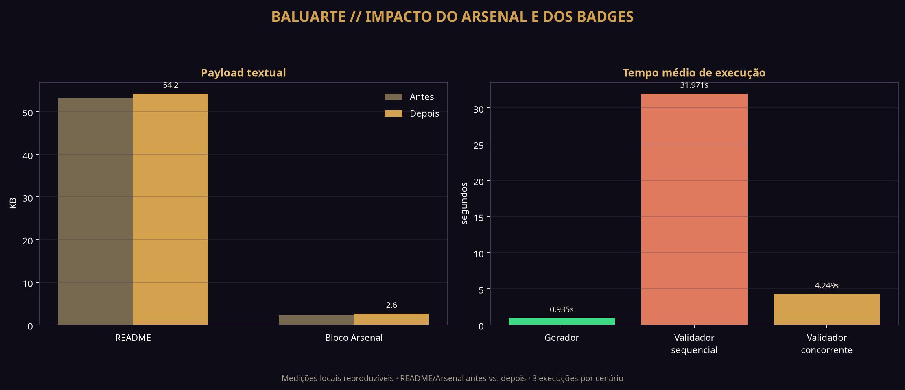

# Relatório de impacto — Arsenal, badges e métricas do perfil

**Perfil analisado:** [Lucas-Belucci-Bellini](https://github.com/Lucas-Belucci-Bellini)  
**Janela das métricas de atividade:** 27/08/2025 a 26/08/2026  
**Data da medição:** 26/08/2026  
**Escopo:** README público, gerador determinístico, cards SVG locais e workflow de validação.

## 1. Resumo executivo

A nova iteração transforma o Arsenal em cinco camadas de leitura: **Linguagens**, **Frameworks & Web**, **Infraestrutura & DevOps**, **IA & Conhecimento** e **Hardware & Simulação**. As 17 linguagens continuam sendo calculadas automaticamente a partir dos mapas públicos de bytes do GitHub. As ferramentas permanecem editoriais, mas agora são agrupadas no manifesto por categoria e cada entrada conserva sua evidência pública.

O problema visual dos rótulos percent-encoded foi eliminado. O texto alternativo agora exibe `C#` e `PL/pgSQL`, enquanto o escape técnico (`%23` e `%2F`) aparece apenas dentro da URL do badge, onde é necessário. O formato de URL foi alinhado ao endpoint de badge estático documentado pelo Shields.io, e as URLs críticas responderam HTTP 200 durante a validação.

Também foi corrigida a leitura dos cards de atividade. O card agora usa os rótulos **CONTRIBUIÇÕES TOTAIS**, **COMMITS DIRETOS** e **REPOS CRIADOS**, deixando explícito que são métricas diferentes. A diferença não é um erro de soma: no período medido, os componentes retornados pelo GitHub fecham exatamente o total de contribuições.

## 2. Impacto visual e estrutural

A comparação abaixo usa como base o README imediatamente anterior a esta iteração e o README regenerado com as categorias, a nota explicativa dos contadores e a remoção da imagem duplicada da matriz.

| Indicador | Antes | Depois | Variação | Interpretação |
|---|---:|---:|---:|---|
| Badges de linguagens | 17 | 17 | 0 | A cobertura técnica foi preservada. |
| Labels percent-encoded visíveis | 0 no parser final, mas havia risco no fallback anterior | 0 | Melhor governança | `C#` e `PL/pgSQL` permanecem legíveis. |
| Categorias de ferramentas | 0 | 4 | +4 | Frameworks, infraestrutura, IA e hardware/simulação agora têm blocos próprios. |
| Camadas visuais do Arsenal | 2 | 5 | +3 | Linguagens e quatro famílias de ferramentas ficam claramente separadas. |
| Imagens da matriz de linguagens | 1 efetiva | 1 efetiva | 0 | A referência duplicada foi removida. |
| Labels duplicados | 0 | 0 | 0 | O validador bloqueia duplicações futuras. |
| Tamanho do bloco Arsenal | 2.342 B | 2.671 B | +329 B / +14,05% | Aumento pequeno em troca de maior hierarquia e evidência. |
| Tamanho total do README | 54.442 B | 55.494 B | +1.052 B / +1,93% | O ganho de estrutura teve baixo custo de payload textual. |
| Linhas do README | 572 | 593 | +21 / +3,67% | O crescimento vem das quatro tabelas categorizadas e da explicação operacional. |

A alteração mais importante é qualitativa: antes, a leitura visual apresentava um bloco único de ferramentas e o leitor precisava inferir a função de cada item. Depois, os títulos funcionam como uma legenda de arquitetura. O visitante identifica primeiro a área de atuação e, em seguida, consulta a tabela de evidências. Isso reduz a ambiguidade sem esconder a matriz completa de linguagens.

A densidade foi controlada de duas formas. Os badges foram distribuídos em linhas curtas, com separação entre **PRINCIPAIS POR VOLUME** e **EXTENSÕES DO PORTFÓLIO**. A matriz de distribuição permanece como um único SVG dinâmico, e o duplicado estático que aparecia logo depois foi removido. O resultado preserva a identidade visual Baluarte/Field Manual sem repetir a mesma informação.

## 3. Organização final do Arsenal

| Camada | Conteúdo | Fonte de verdade | Regra de publicação |
|---|---|---|---|
| **Linguagens** | JavaScript, TypeScript, HTML, CSS, Java, Python, C#, PL/pgSQL, Rust, SQF, Shell, GDScript, PowerShell, Portugol, Batch, ShaderLab e Dockerfile | Mapas públicos de linguagens do GitHub | Peso, participação e quantidade de repositórios calculados automaticamente. |
| **Frameworks & Web** | Vite, React, Tailwind CSS, Electron e MapLibre GL | Manifesto `README_STACK.json` | Só entra com evidência pública documentada. |
| **Infraestrutura & DevOps** | Git, GitHub, VS Code, Linux, Node.js, Docker e Supabase | Manifesto `README_STACK.json` | Papel operacional e evidência são exibidos na tabela. |
| **IA & Conhecimento** | MCP e Obsidian + Claude | Manifesto `README_STACK.json` | A categoria descreve integrações e ferramentas confirmadas publicamente. |
| **Hardware & Simulação** | Unity, Arduino e Flowgorithm + Portugol | Manifesto `README_STACK.json` | A categoria reúne eletrônica, simulação e fundamentos associados ao eixo técnico. |

A camada de linguagens não é misturada às ferramentas porque mede um fenômeno diferente: bytes detectados e repositórios que contêm aquela linguagem. Frameworks, infraestrutura, IA e hardware são uma classificação de contexto de uso, não uma porcentagem de código.

## 4. Validação automática em pull requests

O workflow [`v2-validation.yml`](../.github/workflows/v2-validation.yml) é acionado em pull requests contra `main`, em pushes relevantes e manualmente. A execução agora segue quatro níveis de proteção:

| Etapa | O que verifica | Falha quando |
|---|---|---|
| Compilação | Todos os scripts Python em `.github/scripts`, `scripts` e `tests` | Existe erro de sintaxe. |
| Testes unitários | Monitor do ecossistema, cards de atividade e labels especiais | A regra de negócio ou a proteção contra regressão falha. |
| Contrato de badges | 17 labels únicos, `C#` e `PL/pgSQL` legíveis, endpoint estático, estilo e cores | Um badge volta a exibir escape como texto, usa URL inesperada ou fica duplicado. |
| Coerência da matriz | Quantidade de badges igual à quantidade de linhas de linguagens | A lista visual e a tabela automática ficam dessincronizadas. |
| Disponibilidade | Cada URL do Shields.io responde HTTP 2xx/3xx | Um badge está indisponível ou o serviço retorna erro persistente. |

O validador usa oito conexões concorrentes e até três tentativas com backoff curto para não transformar uma falha transitória de rede em falso negativo. Nas medições locais, a checagem completa passou de uma média de **31,971 s** na versão sequencial para **4,249 s** na versão concorrente, uma redução de **86,71%**. O tempo real no GitHub Actions pode variar por fila, DNS, latência e disponibilidade do Shields.io.

Para tornar a regra obrigatória, o próximo passo administrativo é configurar a proteção da branch `main` exigindo o check `V2 Validation / validate`. Sem essa configuração, o workflow já bloqueia visualmente o PR com falha, mas a política de merge ainda depende das regras atuais do repositório.

## 5. Reconciliação entre contribuições e commits

A API oficial do GitHub retornou os seguintes valores para a janela móvel de 365 dias:

| Componente | Valor | Significado |
|---|---:|---|
| **Contribuições totais** | **1.808** | Total exibido pelo calendário de contribuições. |
| Commits diretos | 1.115 | Apenas commits que atendem aos critérios do GitHub. |
| Pull requests | 535 | Pull requests atribuídos ao perfil. |
| Issues | 94 | Issues atribuídas ao perfil. |
| Reviews | 3 | Reviews de pull request. |
| Repositórios criados/forkados | 61 | Contribuições de repositório retornadas pela coleção. |
| Contribuições restritas | 0 | Contagem restrita retornada para a janela. |

A reconciliação é exata:

```text
1.115 commits
+  535 pull requests
+   94 issues
+    3 reviews
+   61 contribuições de repositório
= 1.808 contribuições totais
```

O GitHub documenta que o gráfico de contribuições pode incluir criação de repositórios, forks, issues, pull requests, reviews, discussões e commits, desde que cada ação atenda aos critérios de atribuição e visibilidade.[1] O campo `totalCommitContributions` da API GraphQL é apenas uma parte da coleção; ele não representa o total do calendário.[2]

Portanto, ver aproximadamente 2 mil contribuições e menos de 2 mil commits é normal. A interface anterior induzia a comparação direta porque usava apenas os rótulos genéricos `CONTRIBUIÇÕES` e `COMMITS`. A correção foi semântica e visual: os cards agora distinguem explicitamente **contribuições totais** de **commits diretos**, e o README inclui uma explicação logo abaixo dos cards.

Há ainda uma terceira métrica que não deve ser misturada às anteriores: o monitor de ecossistema soma commits detectados em repositórios acompanhados e commits produzidos pelo próprio monitor. Esse contador serve para observabilidade do projeto, não para reproduzir o calendário oficial de contribuições.

## 6. Desempenho dos assets e da geração

Os SVGs locais continuam sendo versionados, evitando uma dependência de renderização em tempo real para os cards principais. Na execução atual, os tamanhos observados foram:

| Asset | Tamanho | Função |
|---|---:|---|
| `assets/profile-stats.svg` | 4.307 B | Card principal com decomposição de atividade. |
| `assets/lang-stats.svg` | 4.432 B | Barras proporcionais das 12 linguagens de maior volume. |
| README total | 55.494 B | Conteúdo Markdown público completo. |

O gerador do README, usando o inventário local auditado, executou em **0,786–1,202 s**, com média de **0,935 s** em três medições. O validador completo executou em **3,690–4,801 s**, com média de **4,249 s** em três medições. Esses números medem processamento local e requisições HTTP dos badges; não incluem o tempo de inicialização ou fila do GitHub Actions.

O custo textual da categorização foi baixo: o bloco Arsenal cresceu 329 bytes, enquanto o README inteiro cresceu 1.052 bytes. Em troca, a estrutura ganhou quatro headings de categoria, 17 ferramentas com função/evidência organizadas e uma explicação formal para a reconciliação dos contadores.



*Figura 1 — comparação baseada nas medições locais reproduzíveis descritas neste relatório. O tempo sequencial é a referência da implementação anterior; o tempo concorrente é o novo validador com oito workers e retry curto.*

## 7. Conclusão e manutenção

A estrutura nova resolve simultaneamente três problemas: torna os badges legíveis, melhora a leitura do Arsenal por intenção técnica e evita que contribuições totais sejam interpretadas como quantidade de commits. O sistema também passou a verificar automaticamente a coerência entre badges, matriz e categorias em cada pull request.

A manutenção futura deve alterar o manifesto, o gerador ou os testes, e não editar manualmente o conteúdo entre marcadores. Depois de uma mudança, basta abrir um pull request e observar o check `V2 Validation / validate`. Se ele passar, revisar visualmente o README público e então mesclar. As exclusões editoriais continuam protegidas pelo validador existente e não participam do Arsenal, das métricas ou dos catálogos.

## Referências

[1]: https://docs.github.com/en/account-and-profile/reference/profile-contributions-reference "GitHub Docs — Profile contributions reference"
[2]: https://docs.github.com/en/graphql/reference/objects#contributionscollection "GitHub Docs — ContributionsCollection GraphQL object"
[3]: https://shields.io/badges/static-badge "Shields.io — Static Badge documentation"
[4]: https://github.com/Lucas-Belucci-Bellini/Lucas-Belucci-Bellini/blob/main/.github/workflows/v2-validation.yml "Perfil Lucas Belucci Bellini — V2 validation workflow"
[5]: https://github.com/Lucas-Belucci-Bellini/Lucas-Belucci-Bellini/blob/main/scripts/validate_language_badges.py "Perfil Lucas Belucci Bellini — language badge validator"
