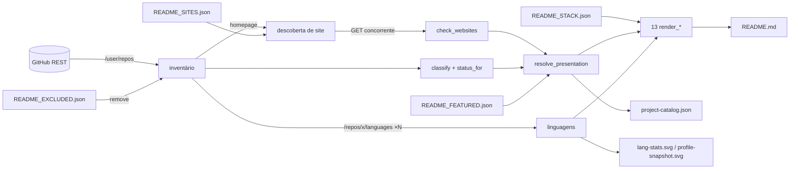

# Fluxo de dados

O caminho de cada dado, da origem até o que o visitante vê — hoje e no alvo.

## 1. Hoje

### 1.1 Inventário → README (`update-profile.yml`, diário — hoje pulado, A1)



O estado anterior de cada bloco é **substituído**. O único registro do que
estava antes é o `git log` — e só quando houve commit.

### 1.2 Os outros quatro fluxos

| Fluxo | Origem | Transformação | Destino | Estado entre execuções |
|:---|:---|:---|:---|:---|
| `lang_stats` + `profile_cards` (semanal) | inventário próprio, `/languages`, `/git/trees`, GraphQL | soma bytes e extensões; contribuições da janela de 365 dias | 6 SVGs | nenhum |
| `ecosystem_watch` (horário) | inventário público próprio, `/commits`, `/compare` | SHA atual vs. anterior; contadores cumulativos | `ECOSYSTEM-COMMIT-STATE.json`, `MONITOR.md` | **sim**: o próprio JSON |
| `contribution_timeline` (diário) | GraphQL, 13 janelas mensais | nenhuma | JSON + HTML Plotly | nenhum |
| `snake` (12 h) | action externa | — | branch `output` | nenhum |

## 2. Alvo: o pipeline

```text
Repository created (GitHub)
        ↓
Repository discovered        sync github      inventário único, ETag, upsert por github_id
        ↓
Metadata collected           sync github      linguagens, homepage, datas → repositories / repository_languages
        ↓
Project classified           sync github      heurística versionada ou rótulo editorial → projects
        ↓
Database updated             (mesma transação da etapa) + sync_runs com contagens e erros
        ↓
Website checked              check sites      GET com redirects e tempo → website_checks (append-only)
        ↓
README regenerated           render all       views públicas → blocos + SVGs + catalog.json → 1 commit
```

Cada etapa é idempotente e independente: pode ser rodada sozinha
(`profile-core sync github`, `profile-core check sites`…) ou em sequência
(`profile-core sync all`).

### 2.1 Contrato de cada etapa

| Etapa | Entrada | Escreve | Idempotência | Falha parcial |
|:---|:---|:---|:---|:---|
| **Descoberta** | `GET /user/repos` (paginado, ETag) | `github_owners`, `repositories` (upsert por `github_id`); `gone_at` para quem sumiu | upsert; `304 Not Modified` não gera escrita | repositório com erro vira `sync_run_errors`; os demais seguem |
| **Metadados** | `GET /repos/{r}/languages` | `repository_languages` (substituição por repositório), `languages` (auto-cadastro) | mesma entrada → mesmas linhas | idem |
| **Exclusão** | `repository_exclusions` | nada: excluído não é inserido (D-019) | — | — |
| **Classificação** | `repositories` + rótulo editorial | `projects.label_slug`, `classifier_version` | classificador puro, versionado | — |
| **Manifestos** | `docs/README_*.json` | `featured_entries`, `stack_tools`, `repository_exclusions`, `websites` (source `manifest`), `projects.summary` | manifesto vence; linha ausente do manifesto é removida da tabela editorial | manifesto inválido aborta a etapa inteira (é dado humano: melhor parar que meio-aplicar) |
| **Sites** | `websites` ativos | `website_checks` (uma linha por checagem) | cada execução acrescenta linhas; o estado atual é a view | timeout/DNS/404 são resultados (`outcome`), não exceções |
| **Commits** | `repositories` públicos | `commit_observations` só em transição (D-020) | sem mudança → nada gravado | `409` vazio/erro vira observação com `error_stage` |
| **Contribuições** | GraphQL | `metric_samples` (janela mensal) | a mais recente por janela vence (`metric_latest`) | etapa falha inteira (fonte única) |
| **Renderização** | views públicas + editorial | README (só entre marcadores), SVGs, `project-catalog.json` | dado igual → bytes iguais → nenhum commit | falha aborta antes de escrever qualquer arquivo |

### 2.2 Onde as regras de negócio vivem

```text
ecosystem-domain (Rust, puro)       views do banco (SQL)
───────────────────────────────     ───────────────────────────────
classificação (versionada)          quem é público (privado/excluído/sumido)
status de ciclo de vida (usa now)   site só se a última checagem = verified
prioridade de vitrine (0–100)       CTA site-primeiro
ordem, cortes, textos dos blocos    totais de linguagem públicos
```

As duas colunas se sobrepõem em um ponto — a regra de CTA — de propósito: o
banco a aplica para qualquer consumidor, o domínio a aplica para renderizar, e
um teste compara as duas.

## 3. Adicionando um projeto novo

O objetivo declarado: projeto novo sem editar dezenas de arquivos.

| Hoje | No alvo |
|:---|:---|
| 1. Criar o repositório | 1. Criar o repositório (com `homepage` preenchida, se houver site) |
| 2. Esperar o refresh diário (que hoje não roda) | 2. Na próxima execução ele é descoberto, classificado, verificado e aparece |
| 3. Para curadoria: editar `README_FEATURED.json`, `FEATURED_PRIORITY` e `FEATURED_SUMMARIES` (dois são código Python) | 3. Para curadoria: **uma** entrada em `README_FEATURED.json` |
| 4. Para site sem `homepage`: `README_SITES.json` | 4. Idem, `README_SITES.json` |
| 5. Para mudar a classificação: editar `classify()` | 5. Rótulo editorial no manifesto (`label`), sem código |

## 4. Transição do estado existente

O que precisa ser importado uma vez, e de onde (detalhe em
[MIGRATIONS.md §6](../database/MIGRATIONS.md)):

| Origem | Destino | Por que importar em vez de recoletar |
|:---|:---|:---|
| `docs/ECOSYSTEM-COMMIT-STATE.json` → `metrics` | `metric_samples` (`legacy_import`) | contadores não podem ser recalculados (A15) |
| `docs/ECOSYSTEM-COMMIT-STATE.json` → `repositories` | `commit_observations` (uma por repo) | vira a base para contar commits novos |
| `docs/assets/contributions-timeline-data.json` | `metric_samples` | preserva a série já coletada |
| `docs/README_*.json` | tabelas editoriais | é a autoria atual |
| `docs/project-catalog.json` (`website_declared`/`website_status`) | `websites` + uma `website_check` inicial, ligada a um `sync_run` do tipo `legacy_import` | primeiro ponto do histórico de disponibilidade |
