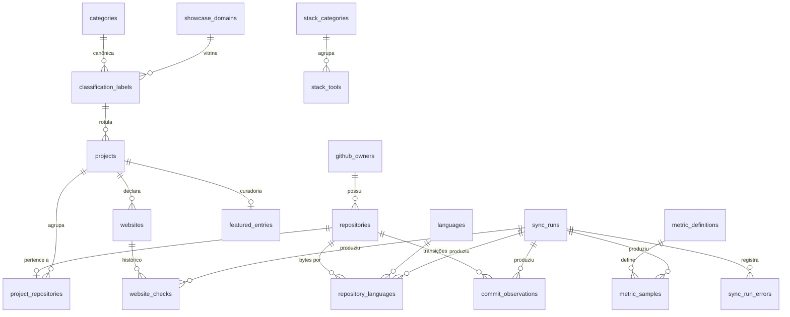

# Modelo de dados

Schema `ecosystem`, definido em [`db/migrations`](../../db/migrations) e testado
por [`db/tests/run.sh`](../../db/tests/run.sh). Este documento explica o que
cada tabela guarda, **por que** ela tem essa forma e onde o modelo diverge do
esboço inicial.

## 1. Diagrama



`repository_exclusions` não tem relação: guarda nomes, não repositórios (D-019).

## 2. Tabelas

### Execuções — `0001_foundation`

| Tabela | Chave | Guarda | Regras |
|:---|:---|:---|:---|
| `sync_runs` | `id` | tipo, gatilho, origem, SHA do código, id externo, status, início/fim, contagens | `running` ⇔ sem fim; fim ≥ início; `failed` exige mensagem |
| `sync_run_errors` | `id` | falhas parciais por sujeito e etapa | cascata com a execução |

### Repositórios — `0002_repositories`

| Tabela | Chave | Guarda | Regras |
|:---|:---|:---|:---|
| `github_owners` | `id`; único `github_id` | login, tipo | login **não** é único ao longo do tempo |
| `languages` | `name` (nome do GitHub) | rótulo público, cor do badge, cor do gráfico | cores em hex de 6 dígitos; 16 linguagens de referência |
| `repositories` | `id`; único `github_id` | recorte do GitHub + `first_seen_at`, `last_synced_at`, `gone_at`, `etag` | `full_name` termina em `/name`; nome ativo único sem diferenciar maiúsculas, adiável |
| `repository_languages` | (`repository_id`, `language`) | bytes atuais | bytes ≥ 0; percentual não é armazenado |
| `repository_exclusions` | `id`; único `lower(match_name)` | nome casado, motivo, origem | sem FK de propósito |

### Projetos — `0003_projects`

| Tabela | Chave | Guarda | Regras |
|:---|:---|:---|:---|
| `categories` | `slug` | as 12 categorias canônicas | referência |
| `showcase_domains` | `slug` | os 6 domínios da vitrine (ícone, título, resumo) | referência |
| `classification_labels` | `slug` | os 9 rótulos do README → categoria + domínio | ambos `NOT NULL` — "todo rótulo cai num domínio" |
| `projects` | `id`; único `slug` | nome, resumo editorial, rótulo + origem + versão do classificador, sobreposição de ciclo de vida, publicação | slug seguro para rota; rótulo heurístico exige versão; editorial exige rótulo |
| `project_repositories` | (`project_id`, `repository_id`) | papel do repositório no projeto | repositório em um só projeto; um primário por projeto |
| `featured_entries` | `project_id` | posição, prioridade 0–100, rótulo, foco, motivo, `website_required` | posição única e adiável (reordenar numa transação) |

### Sites — `0004_websites`

| Tabela / view | Guarda | Regras |
|:---|:---|:---|
| `websites` | URL declarada, origem (`github_homepage`, `manifest`, `editorial`), primário, status esperado, `declared_at`/`retired_at` | mesma expressão de URL do Python; um primário ativo por projeto; **não existe origem "deduzida"** |
| `website_checks` | cada checagem: resultado, HTTP, destino final, nº de redirects, tempo, tentativas, tipo e mensagem de erro | **append-only**; `verified` exige HTTP e nenhum erro; falha exige tipo de erro |
| `website_status_current` (view) | última checagem de cada site ativo, `is_online` | paridade: online ⇔ última = `verified` |
| `website_uptime_30d` (view) | checagens, sucessos, % e tempo médio em 30 dias | o dado que o sistema atual não consegue ter |

### Atividade e métricas — `0005_activity_metrics`

| Tabela / view | Guarda | Regras |
|:---|:---|:---|
| `commit_observations` | transições do último commit por repositório; commits desde a anterior | **append-only**; exatamente um estado: commit, vazio ou erro (com etapa) |
| `repository_head_current` (view) | estado atual de cada repositório | |
| `metric_definitions` | chave, escopo, unidade, descrição, fonte | 11 definições de referência |
| `metric_samples` | valor, sujeito, dimensão, janela, coleta, proveniência, execução | **append-only**; escopo imposto por trigger; janela ordenada |
| `metric_latest` (view) | valor mais recente de cada série | |

### Arsenal — `0006_editorial_stack`

| Tabela | Guarda |
|:---|:---|
| `stack_categories` | as 4 categorias, ícone e ordem (hoje `category_order` no código) |
| `stack_tools` | ferramenta, categoria, papel, evidência (não vazia), ordem |

### Projeção pública — `0007_public_views`

| View | Contrato |
|:---|:---|
| `listed_repositories` | não sumido e não excluído — o filtro de exclusão existe só aqui |
| `public_repositories` | `listed_repositories` + visibilidade pública |
| `public_projects` | projeto publicável com repositório primário público; site só se online; CTA derivado; curadoria |
| `private_repository_listing` | divulgação privada autorizada: nome, link, descrição, rótulo — sem site nem linguagem |
| `public_language_totals` | bytes, repositórios e participação por linguagem, só públicos |

## 3. Do esboço inicial ao modelo

O pedido trazia um esboço explicitamente "não definitivo". O que mudou e por quê:

| Esboço | Modelo | Motivo |
|:---|:---|:---|
| `repositories.owner` (texto) | `github_owners` + FK | o inventário inclui repositórios de outros donos (colaborador: `itssomeone4/Atividade4`) |
| `repositories.archived`, `language` | `is_archived`, `primary_language` → FK `languages` | nomes explícitos; linguagem normalizada com rótulo e cor |
| `updated_at` = do GitHub | `github_updated_at`, `github_pushed_at` **e** `updated_at` da linha | três datas diferentes; o status usa `pushed_at` |
| sem soft delete | `gone_at` | repositório apagado não pode levar o histórico junto (D-005) |
| `projects.repository_id` | `project_repositories` (N:1 com papel) | um projeto pode ter vários repositórios; hoje 1:1 |
| `projects.category`, `status` (texto livre) | `label_slug` → taxonomia; `lifecycle_override` | categoria fechada por FK; status é calculado, só a exceção editorial é guardada |
| `projects.featured`, `private` | `featured_entries`; visibilidade vem do repositório; `publication` | curadoria tem 6 atributos; "privado" é fato do GitHub, "publicável" é decisão editorial |
| `websites.current_status`, `last_checked_at`, `response_time`, `redirect_target`, `is_online` | `website_checks` + view `website_status_current` | o pedido quer histórico; coluna de estado atual divergiria dele (D-007) |
| `websites.expected_status` | mantido, opcional | `NULL` = paridade (qualquer 2xx/3xx após redirects) |
| `deployments` | **adiada** (D-016) | não há produtor de dado de deployment; site ≠ deployment |
| `languages.percentage` | não armazenado | derivado; ficaria inconsistente com `bytes` |
| `metrics(metric_name, metric_value)` | `metric_definitions` + `metric_samples` com janela, dimensão e proveniência | contribuições são por janela; contadores legados precisam de proveniência |
| `sync_runs.source` | + `kind`, `trigger`, `code_version`, `external_ref`, contagens, `sync_run_errors` | responder "qual execução, com qual código, decidiu isto?" |
| — | `repository_exclusions`, `featured_entries`, `stack_*`, taxonomia | eram JSON manual ou constantes no código |
| — | `commit_observations` | o monitor horário existe e tem estado |

## 4. Planejado, ainda sem migration

### `deployments` (D-016)

```text
deployments
  id, project_id → projects, website_id → websites (opcional)
  provider        vercel | github_pages | netlify | other
  environment     production | preview
  provider_ref    id do deploy no provedor (único por provedor)
  git_sha         40 hex
  state           queued | building | ready | error | canceled
  created_at, ready_at, observed_at, sync_run_id → sync_runs
```

Entra junto com o coletor que a alimenta (API da Vercel ou GitHub Deployments).

### Linguagens ao longo do tempo

Se a evolução da matriz de linguagens interessar, cada sincronização grava
`ecosystem.languages.public_bytes` (dimensão = linguagem) em `metric_samples`.
A definição já existe; nenhuma tabela nova é necessária.

## 5. Mapeamento dos arquivos atuais

| Arquivo | Campo | Destino |
|:---|:---|:---|
| `README_SITES.json` | `"owner/repo": url` ou `{website}` | `websites` (`source = manifest`) |
| `README_FEATURED.json` | `order`, `priority`, `label`, `focus`, `reason`, `website_required` | `featured_entries` |
| `README_STACK.json` | `name`, `category`, `family`, `evidence` | `stack_tools` (+ `stack_categories` se nova) |
| `README_EXCLUDED.json` | `repositories[]`, `reason` | `repository_exclusions` |
| `update_profile.FEATURED_SUMMARIES` | texto | `projects.summary` |
| `update_profile.FEATURED_PRIORITY` | peso | `featured_entries.priority` (ou heurística versionada) |
| `update_profile.status_for` (nomes fixos) | status | `projects.lifecycle_override` |
| `update_profile.LANGUAGE_*` | rótulo, cor | `languages` |
| `project-catalog.json` | `website_declared`, `website_status`, `website_http_status` | `websites` + checagem inicial |
| `ECOSYSTEM-COMMIT-STATE.json` | `repositories.*` | `commit_observations` (uma por repositório) |
| `ECOSYSTEM-COMMIT-STATE.json` | `metrics.*` | `metric_samples` (`legacy_import`) |
| `contributions-timeline-data.json` | `rows[]` | `metric_samples` (`profile.contributions.*`, janela mensal) |

## 6. Convenções

- Chaves substitutas `bigint GENERATED ALWAYS AS IDENTITY`; chaves naturais
  (`github_id`, `slug`) com `UNIQUE`.
- `timestamptz` sempre; UTC na aplicação.
- Enumerações como `text` + `CHECK` (evoluem por migration simples).
- Nomes de tabela em inglês e no plural; comentários e mensagens em português,
  como o resto do repositório.
- Toda tabela editável tem `created_at`/`updated_at`, e o `updated_at` é do
  banco (trigger `touch_updated_at`), não da aplicação.
